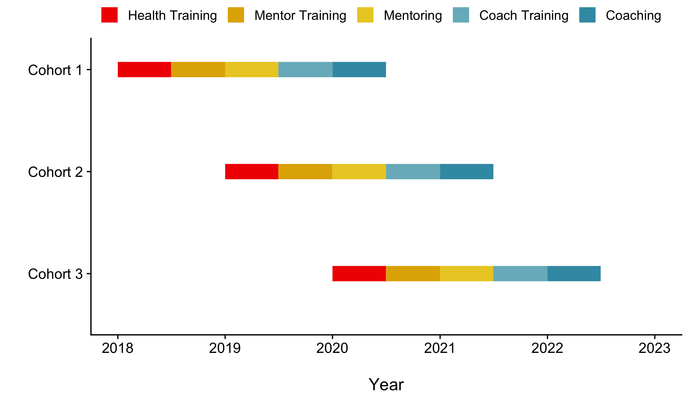

```{r, include = FALSE}
knitr::opts_chunk$set(echo = FALSE)

#Initialize libraries to be used
library(tidyverse)
  #tidyverse causes LaTeX error when outputting to PDF...change to "xelatex" from PDF options. Or use      HTML
library(readxl)
library(haven)
library(psych)
library(dplyr)
library(readr)
library(stringr)
library(cowplot)
theme_set(theme_cowplot())
library(tableone)      # table 1
library(kableExtra)    # HTML tables

#need to label variables
library(Hmisc)

# libraries for longitudinal data analysis, from the datacamp package
library(lme4)
library(nlme)

# functions to make timeline
library(timelineS)    # timelineS
library(vistime)      # this makes a timeline
library(plotly)       # for exporting timeline to .png
library(lubridate)    # allows adding months to dates
library(scales)
library(wesanderson)

col_usc_red <- "#990000"
col_usc_yel <- "#FFCC00"

# function that sets manual colors on plots
yh_cohort_colors <- function(){
  # color patterns for cohorts
  col_cohort1 <- "#cc6666"
  col_cohort2 <- "#33cccc"
  col_cohort3 <- "#99cc33"
  
  scale_color_manual(values=c("Cohort 1" = col_cohort1, "Cohort 2" = col_cohort2, "Cohort 3" = col_cohort3))
}
```


#Timeline{.tabset}

The image shows the expected timeline of the [YouHeaL study](https://www.youhealprogram.com/). The study is designed to have 3 cohorts that each begin one year apart.  

During the first 6 months the first cohort is trained as Community Health Promoters (CHP) and completes a service project. The second 6 months, they are trained as Peer Health Mentors (PHM), where they learn to train their classmates to be CHPs. During the third 6 month period, Cohort 1 become PHMs that train Cohort 2 to be CHPs. At this point Cohort 2 begins doing everything Cohort 1 started, but 1 year behind them. During the fourth 6 month period, Cohort 1 is trained as Peer Health Leaders (PHL), where they learn to train the CHPs to become PHMs for Cohort 3, and then PHLs from Cohort 1 actually train Cohort 2 to be PHMs. Finally, during the fifth 6 month period, the PHLs from Cohort 1 work with the PHMs from Cohort 2 to train Cohort 3 to be CHPs.  

Each cohort is larger than the last, propagating healthy lifestyle habits to increasingly larger groups of high school students through their social networks.

##Timeline, timelineS

Timeline created using the [timelineS package](https://github.com/daheelee/timelineS).

```{r timeline_timelineS, echo = FALSE, include = FALSE, message = FALSE}
# function that creates timeline data
get_data_timelineS <- function(){
  
  # start dates for different phases of cohort 1
  phase1_start <- as.Date("2018-1-1")
  phase2.1_start <- phase1_start %m+% months(6)
  phase2.2_start <- phase1_start %m+% months(12)
  phase3.1_start <- phase2.1_start %m+% months(12)
  phase3.2_start <- phase2.2_start %m+% months(12)
  
  # create cohort 1 information
  cohort1 <- c(phase1_start, phase2.1_start, phase2.2_start, phase3.1_start, phase3.2_start) %>% 
    as.data.frame() %>% 
    cbind(phase = c("1", "2.1", "2.2", "3.1", "3.2")) %>% 
    dplyr::rename(.data = ., start = .) %>% 
    mutate(
      end = start %m+% months(6),
      cohort = 1
    ) %>% select(cohort, phase, everything())
  
  # create cohort 2 information, all dates start 1 year after cohort 1
  cohort2 <- cohort1 %>% 
    mutate(
      start = start %m+% months(12),
      end = end %m+% months(12),
      cohort = 2
    )
  
  # create cohort 3 information, all dates start 2 years after cohort 1
  cohort3 <- cohort1 %>% 
    mutate(
      start = start %m+% months(24),
      end = end %m+% months(24),
      cohort = 3
    )
  
  # combine information into a single dataset
  rbind(cohort1, cohort2, cohort3) %>% 
    # format factor levels for phases
    mutate(
      cohort = factor(cohort, levels = rev(c(1, 2, 3)), labels = rev(c("Cohort 1", "Cohort 2", "Cohort 3"))),
      phase = factor(phase,
                     levels = c("1", "2.1", "2.2", "3.1", "3.2"),
                     labels = c("Health Training", "Mentor Training", "Mentoring", "Coach Training", "Coaching")
                     )
      )
}

# save timeline data
data_timelineS <- get_data_timelineS() 
  
# make timeline
plot_timelineS <- function(data){
  
  ggtimeline <- data %>% timelineG(start = "start", end = "end", names = "cohort", phase = "phase") +
    theme(
      legend.position = "top",
      legend.text = element_text(size = 10),
      legend.title = element_blank()
    ) +
    scale_x_date(date_breaks = "1 year", 
                   labels = date_format("%Y"),
                   limits = as.Date(c('2018-01-01','2023-01-01'))) +
    ylim(c("Cohort 3", "Cohort 2", "Cohort 1")) +
    ylab("") +
    xlab("\nYear") +
    scale_color_manual(values = rev(wes_palette(n = 5, name = "Zissou1")))
  
}

# save copy of timeline overall
ggtimeline_all <- data_timelineS %>% plot_timelineS()
dev.copy(png, "YouHeaL_ggtimeline_all.png", width = 2400, height = 1400, res = 300)
ggtimeline_all
dev.off()

# save step by step timelines for presentation

##timeline1
ggtimeline1 <- data_timelineS %>% dplyr::filter(start < as.Date("2018-06-01")) %>% plot_timelineS()
dev.copy(png, "Timeline/YouHeaL_ggtimeline1.png", width = 2400, height = 1400, res = 300)
ggtimeline1
dev.off()

##timeline2
ggtimeline2 <- data_timelineS %>% dplyr::filter(start < as.Date("2019-01-01")) %>% plot_timelineS()
dev.copy(png, "Timeline/YouHeaL_ggtimeline2.png", width = 2400, height = 1400, res = 300)
ggtimeline2
dev.off()

##timeline3
ggtimeline3 <- data_timelineS %>% dplyr::filter(start < as.Date("2019-06-01")) %>% plot_timelineS()
dev.copy(png, "Timeline/YouHeaL_ggtimeline3.png", width = 2400, height = 1400, res = 300)
ggtimeline3
dev.off()

##timeline4
ggtimeline4 <- data_timelineS %>% dplyr::filter(start < as.Date("2020-01-01")) %>% plot_timelineS()
dev.copy(png, "Timeline/YouHeaL_ggtimeline4.png", width = 2400, height = 1400, res = 300)
ggtimeline4
dev.off()

##timeline5
ggtimeline5 <- data_timelineS %>% dplyr::filter(start < as.Date("2020-06-01")) %>% plot_timelineS()
dev.copy(png, "Timeline/YouHeaL_ggtimeline5.png", width = 2400, height = 1400, res = 300)
ggtimeline5
dev.off()

##timeline6
ggtimeline6 <- data_timelineS %>% dplyr::filter(start < as.Date("2021-01-01")) %>% plot_timelineS()
dev.copy(png, "Timeline/YouHeaL_ggtimeline6.png", width = 2400, height = 1400, res = 300)
ggtimeline6
dev.off()

##timeline7
ggtimeline7 <- data_timelineS %>% dplyr::filter(start < as.Date("2021-06-01")) %>% plot_timelineS()
dev.copy(png, "Timeline/YouHeaL_ggtimeline7.png", width = 2400, height = 1400, res = 300)
ggtimeline7
dev.off()

##timeline8
ggtimeline8 <- data_timelineS %>% dplyr::filter(start < as.Date("2022-01-01")) %>% plot_timelineS()
dev.copy(png, "Timeline/YouHeaL_ggtimeline8.png", width = 2400, height = 1400, res = 300)
ggtimeline8
dev.off()

##timeline9
ggtimeline9 <- data_timelineS %>% dplyr::filter(start < as.Date("2022-06-01")) %>% plot_timelineS()
dev.copy(png, "Timeline/YouHeaL_ggtimeline9.png", width = 2400, height = 1400, res = 300)
ggtimeline9
dev.off()
```


##Timeline, vistime

Timeline created using the [vistime package](https://github.com/shosaco/vistime).

```{r timeline_vistime, echo = FALSE, include = FALSE, message = FALSE}

# start dates for different phases of cohort 1
phase1_start <- as.Date("2018-1-1")
phase2.1_start <- phase1_start %m+% months(6)
phase2.2_start <- phase1_start %m+% years(1)
phase3.1_start <- phase2.1_start %m+% years(1)
phase3.2_start <- phase2.2_start %m+% years(1)

# cohort 1 start dates
cohort1_start <- c(phase1_start, phase2.1_start, phase2.2_start, phase3.1_start, phase3.2_start)

# cohort 1 end dates, 6 months after start
cohort1_end <- cohort1_start %m+% months(6)


# cohort 2 start dates, same time as cohort 1 end dates
cohort2_start <- cohort1_start %m+% years(1)

# cohort 2 end dates, 6 months after start
cohort2_end <- cohort2_start %m+% months(6)


# cohort 3 start dates, same time as cohort 2 end dates
cohort3_start <- cohort2_start %m+% years(1)

# cohort 3 end dates, 6 months after start
cohort3_end <- cohort3_start %m+% months(6)


# list for timeline
YouHeaL_time <- data.frame(
    
  id      = c("Cohort 1", "Cohort 1", "Cohort 1", "Cohort 1", "Cohort 1", 
              "Cohort 2", "Cohort 2", "Cohort 2", "Cohort 2", "Cohort 2", 
              "Cohort 3", "Cohort 3", "Cohort 3", "Cohort 3", "Cohort 3"),
  
  content = c(
    "Phase 1\nCHP Training &\nService Project", "Phase 2.1\nPHM Training\n& CHP Recruit", "Phase 2.2\nPHMs Train\nCHPs", "Phase 3.1\nPHL Training &\nPHLs Train PHMs", "Phase 3.2\nPHL & PHMs\nTrain CHPs",
    "Phase 1", "Phase 2.1", "Phase 2.2", "Phase 3.1", "Phase 3.2",
    "Phase 1", "Phase 2.1", "Phase 2.2", "Phase 3.1", "Phase 3.2"
    ),
  
  # Example format: 2016-02-14 15:00:00
  start = c(cohort1_start, cohort2_start, cohort3_start),
  
  end   = c(cohort1_end, cohort2_end, cohort3_end),
  
  color = rep(c("#cbb69d", "#603913", "#c69c6e", "#c69c6e", "#c69c6e"), 3)
  
)

timeline <- vistime(data = YouHeaL_time, events = "content", groups = "id", start = "start", end = "end", background_lines = 9, colors = "color")

# save the image locally 
orca(p = timeline, file = "YouHeaL_timeline.png", format = 'png', width = 1200, height = 500, scale = 4)
```


#Data Management{.tabset}

The following steps are documented to explain how the data has been cleaned before the analysis. It is not important for most people to understand this, but it is written here to explain the data management process to future analysts.

##Variable Naming Convention

During the previous analysis, each variable was scored as baseline for Phase 1, and follow-up for Phase 2.1. From here on, Google Forms will be used to collect data in a standardized way. Variables are named by the following conventions.  

yh_cohort#_datatype_phase#, where:  

"cohort#" is cohort1, cohort2, or cohort3

"datatype" is sociodem, anthro, YRBS, efficacy, or empower  

"phase#" is phase1, phase2.1, phase2.2, phase3.1, or phase 3.2

##Data Paths

This chunk loads data for all the subsequent data collections. This data was collected using the google form.  

Note, for cohort 1, phase 1 and phase 2.1 were manually input into excel. A previous program formatted this data and saved it as an R dataset.  

Starting with cohort 1, phase 2.2, as well as for all subsequent cohorts, data was entered using a google form, allowing a uniform formatting using functions in this program. All data imports starting with cohort 1, phase 2.2 should have the same process for loading data.

```{r data_paths, echo = FALSE}

# cohort 1
data.path.c1 <- "/Volumes/GoogleDrive/My Drive/20180823 YouHeal/Data/Cohort 1"
# cohort 1: phase 1, phase 2.1, phase 2.2
data.path.c1.p1p2 <- "/Volumes/GoogleDrive/My Drive/20180823 YouHeal/Data/!Clean Datasets"
# cohort 1, phase 2.2
data.path.c1.p2.2 <- "/Volumes/GoogleDrive/My Drive/20180823 YouHeal/Data/Cohort 1/Phase 2.2"
# cohort 1, phase 3.1
data.path.c1.p3.1 <- "/Volumes/GoogleDrive/My Drive/20180823 YouHeal/Data/Cohort 1/Phase 3.1"

# cohort 2
data.path.c2 <- "/Volumes/GoogleDrive/My Drive/20180823 YouHeal/Data/Cohort 2"
data.path.c2.p1 <- "/Volumes/GoogleDrive/My Drive/20180823 YouHeal/Data/Cohort 2/Phase 1"
# cohort 2, phase 2.1
data.path.c2.p2.1 <- "/Volumes/GoogleDrive/My Drive/20180823 YouHeal/Data/Cohort 2/Phase 2.1"

#cohort 3
```

##Load Data from Cohorts and Phases

This chunk loads data for Cohort 1 for Phases 1 and 2.1. This data was from the previously cleaned data in the previous analysis.

```{r loadP1P2.1Data, echo = FALSE}

#set directory to "Data" folder where .CSV files are located
setwd(data.path.c1.p1p2)

#import phase 1 and phase 2.1 data
load(file = "Phase1_Scored.RData")
```


###Cohort 1 (C1)

Cohort 1, Phase 1 and Phase 2.1 were cleaned using previous code, and saved as a single dataset. This section takes this dataset and tidies it so it will match subsequent data collections, which will be collected using a [Google Form](https://docs.google.com/forms/d/e/1FAIpQLScYYCT2T8FhgbfYV5c6LHLVtrtcxSaBXMpgN363Atb-9C3Vdw/viewform). All subsequent data will be in the same format. The functions built below will automatically import the datasets, and make tidying the data much more efficient for analyses of data collected during future phases.


####C1, Phase 1

Format data from Cohort 1, Phase 1, so that it matches the data imported using the Google Form.

```{r clean_c1p1, echo = FALSE}

#subset sociodemographic data
yh_cohort1_sociodem_phase1 <- YH_phase1_score %>% select(ID, sex, age, language1, language2, english_prof, race, city, zip)

# put this in a function do not get excess datasets in global environment
clean_c1p1 <- function(){

  # subset phase 1 anthro data
  yh_cohort1_anthro_phase1 <- YH_phase1_score %>% select(
    ID,
    TSF_1 = base_TSF_1, TSF_2 = base_TSF_2, TSF_3 = base_TSF_3, 
    WC_1 = base_WC_1, WC_2 = base_WC_2, WC_3 = base_WC_3
    )
  
  # subset phase 1 YRBS data
  yh_cohort1_YRBS_phase1 <- YH_phase1_score %>% select(
    ID,
    Q7_YRBS_juice = base_Q7_YRBS_juice,
    Q8_YRBS_fruit = base_Q8_YRBS_fruit,
    Q9_YRBS_salad = base_Q9_YRBS_salad, 
    Q10_YRBS_potato = base_Q10_YRBS_potato,
    Q11_YRBS_carrot = base_Q11_YRBS_carrot,
    Q12_YRBS_otherveg = base_Q12_YRBS_otherveg,
    Q13_YRBS_soda = base_Q13_YRBS_soda,
    Q14_YRBS_sportdrink = base_Q14_YRBS_sportdrink,
    Q15_YRBS_water = base_Q15_YRBS_water,
    Q16_YRBS_milk = base_Q16_YRBS_milk,
    Q17_YRBS_breakfast = base_Q17_YRBS_breakfast,
    Q18_YRBS_allergy = base_Q18_YRBS_allergy,
    Q19_YRBS_physical = base_Q19_YRBS_physical,
    Q20_YRBS_strength = base_Q20_YRBS_strength,
    Q21_YRBS_tv = base_Q21_YRBS_tv,
    Q22_YRBS_screentime = base_Q22_YRBS_screentime,
    Q23_YRBS_pe = base_Q23_YRBS_pe,
    Q24_YRBS_sportsteam = base_Q24_YRBS_sportsteam,
    Q25_YRBS_concussion = base_Q25_YRBS_concussion
  )
  
  # subset phase 1 efficacy data
  yh_cohort1_efficacy_phase1 <- YH_phase1_score %>% select(
    ID,
    Q26_efficacy = base_Q26_efficacy,
    Q27_efficacy = base_Q27_efficacy,
    Q28_efficacy = base_Q28_efficacy,
    Q29_efficacy = base_Q29_efficacy,
    Q30_efficacy = base_Q30_efficacy,
    Q31_efficacy = base_Q31_efficacy,
    Q32_efficacy = base_Q32_efficacy,
    Q33_efficacy = base_Q33_efficacy,
    Q34_efficacy = base_Q34_efficacy,
    Q35_efficacy = base_Q35_efficacy
  )
  
  # subset phase 1 empower data
  yh_cohort1_empower_phase1 <- YH_phase1_score %>% select(
    ID,
    Q36_empower = base_Q36_empower,
    Q37_empower = base_Q37_empower,
    Q38_empower = base_Q38_empower,
    Q39_empower = base_Q39_empower,
    Q40_empower = base_Q40_empower,
    Q41_empower = base_Q41_empower,
    Q42_empower = base_Q42_empower,
    Q43_empower = base_Q43_empower,
    Q44_empower = base_Q44_empower,
    Q45_empower = base_Q45_empower,
    Q46_empower = base_Q46_empower,
    Q47_empower = base_Q47_empower
  )
  
  # add cohort and phase variables, join data into single dataset 
  yh_cohort1_phase1 <- yh_cohort1_sociodem_phase1 %>%
    select(ID) %>% 
    
    # add cohort and phase variables
    mutate(
      cohort = "Cohort 1",
      phase = "Phase 1"
    ) %>% 
    
    # join phase 1 data into single dataset
    full_join(y = yh_cohort1_sociodem_phase1, by = "ID") %>% 
    full_join(y = yh_cohort1_anthro_phase1, by = "ID") %>% 
    full_join(y = yh_cohort1_YRBS_phase1, by = "ID") %>% 
    full_join(y = yh_cohort1_efficacy_phase1, by = "ID") %>% 
    full_join(y = yh_cohort1_empower_phase1, by = "ID")
}

# call function, save dataset for cohort 1, phase 1
yh_cohort1_phase1 <- clean_c1p1()

# make a character string of all the ID's in the baseline cohort
id_cohort1 <- yh_cohort1_phase1$ID
```


####C1, Phase 2.1

Format data from Cohort 1, Phase 2.1, so that it matches the data imported using the Google Form.

```{r clean_c1p2.1, echo = FALSE}

# put this in a function do not get excess datasets in global environment
clean_c1p2.1 <- function(){
  
  # subset phase 2.1 anthro data
  yh_cohort1_anthro_phase2.1 <- YH_phase1_score %>% select(
    ID,
    TSF_1 = flup_TSF_1, TSF_2 = flup_TSF_2, TSF_3 = flup_TSF_3, 
    WC_1 = flup_WC_1, WC_2 = flup_WC_2, WC_3 = flup_WC_3
    )
  
  # subset phase 1 YRBS data
  yh_cohort1_YRBS_phase2.1 <- YH_phase1_score %>% select(
    ID,
    Q7_YRBS_juice = flup_Q7_YRBS_juice,
    Q8_YRBS_fruit = flup_Q8_YRBS_fruit,
    Q9_YRBS_salad = flup_Q9_YRBS_salad, 
    Q10_YRBS_potato = flup_Q10_YRBS_potato,
    Q11_YRBS_carrot = flup_Q11_YRBS_carrot,
    Q12_YRBS_otherveg = flup_Q12_YRBS_otherveg,
    Q13_YRBS_soda = flup_Q13_YRBS_soda,
    Q14_YRBS_sportdrink = flup_Q14_YRBS_sportdrink,
    Q15_YRBS_water = flup_Q15_YRBS_water,
    Q16_YRBS_milk = flup_Q16_YRBS_milk,
    Q17_YRBS_breakfast = flup_Q17_YRBS_breakfast,
    Q18_YRBS_allergy = flup_Q18_YRBS_allergy,
    Q19_YRBS_physical = flup_Q19_YRBS_physical,
    Q20_YRBS_strength = flup_Q20_YRBS_strength,
    Q21_YRBS_tv = flup_Q21_YRBS_tv,
    Q22_YRBS_screentime = flup_Q22_YRBS_screentime,
    Q23_YRBS_pe = flup_Q23_YRBS_pe,
    Q24_YRBS_sportsteam = flup_Q24_YRBS_sportsteam,
    Q25_YRBS_concussion = flup_Q25_YRBS_concussion
  )
  
  # subset phase 1 efficacy data
  yh_cohort1_efficacy_phase2.1 <- YH_phase1_score %>% select(
    ID,
    Q26_efficacy = flup_Q26_efficacy,
    Q27_efficacy = flup_Q27_efficacy,
    Q28_efficacy = flup_Q28_efficacy,
    Q29_efficacy = flup_Q29_efficacy,
    Q30_efficacy = flup_Q30_efficacy,
    Q31_efficacy = flup_Q31_efficacy,
    Q32_efficacy = flup_Q32_efficacy,
    Q33_efficacy = flup_Q33_efficacy,
    Q34_efficacy = flup_Q34_efficacy,
    Q35_efficacy = flup_Q35_efficacy
  )
  
  # subset phase 1 empower data
  yh_cohort1_empower_phase2.1 <- YH_phase1_score %>% select(
    ID,
    Q36_empower = flup_Q36_empower,
    Q37_empower = flup_Q37_empower,
    Q38_empower = flup_Q38_empower,
    Q39_empower = flup_Q39_empower,
    Q40_empower = flup_Q40_empower,
    Q41_empower = flup_Q41_empower,
    Q42_empower = flup_Q42_empower,
    Q43_empower = flup_Q43_empower,
    Q44_empower = flup_Q44_empower,
    Q45_empower = flup_Q45_empower,
    Q46_empower = flup_Q46_empower,
    Q47_empower = flup_Q47_empower
  )
  
  # add cohort and phase variables, join data into single dataset 
  yh_cohort1_phase2.1 <- yh_cohort1_sociodem_phase1 %>%
    select(ID) %>% 
    
    # add cohort and phase variables
    mutate(
      cohort = "Cohort 1",
      phase = "Phase 2.1"
    ) %>% 
    
    # join phase 2.1 data into single dataset
    full_join(y = yh_cohort1_sociodem_phase1, by = "ID") %>% 
    full_join(y = yh_cohort1_anthro_phase2.1, by = "ID") %>% 
    full_join(y = yh_cohort1_YRBS_phase2.1, by = "ID") %>% 
    full_join(y = yh_cohort1_efficacy_phase2.1, by = "ID") %>% 
    full_join(y = yh_cohort1_empower_phase2.1, by = "ID")
}

yh_cohort1_phase2.1 <- clean_c1p2.1()
```


####Select Google Form Variables  

This chunk contains functions that are used to load variables from the Google Form output, by selecting appropriate variables and renaming them to the standard naming convention.  

```{r loadGF, echo = FALSE}

# load and rename sociodemographics that are collected on Phase 1 only (i.e. not on repeated measurements)
load_GF_sociodem_phase1 <- function(dataset){
  dataset %>%
    select(
      ID = "Survey ID",
      DOC = "Timestamp",
      DOB = "Date of Birth",
      sex = "1. What is your gender?",
      age = "2. What is your age?",
      language1 = starts_with("3. What language"),
      language2 = starts_with("3a) What other language"),
      english_prof = starts_with("4. How well do you speak"),
      race = starts_with("5. What is your race?"),
      city = starts_with("6a. In what city"),
      zip = starts_with("6b. In what Zip")
    ) %>%
    # rename ID variable as numeric
    mutate(ID = as.double(ID))
}

# load and rename sociodemographics that are collected on repeated measurements only (i.e. all phases except Phase 1)
load_GF_sociodem_repeat <- function(dataset){
  dataset %>%
    select(
      ID = "Survey ID",
      DOC = "Timestamp",
      DOB = "Date of Birth"
    ) %>%
    # rename ID variable as numeric
    mutate(ID = as.double(ID))
}


# load and rename anthropometric variables
load_GF_anthro <- function(dataset){
  dataset %>% 
    select(
      ID = "Survey ID",
      TSF_1 = "Tricep Skinfold 1",
      TSF_2 = "Tricep Skinfold 2",
      TSF_3 = "Tricep Skinfold 3",
      WC_1 = "Waist Circumference 1",
      WC_2 = "Waist Circumference 2",
      WM_1 = "Weight Measurement 1",
      WM_2 = "Weight Measurement 2",
      HM_1 = "Height Measurement 1",
      HM_2 = "Height Measurement 2"
      ) %>%  
    # format ID and anthopometric variables to numeric
    mutate(
      ID = as.double(ID),
      TSF_1 = as.numeric(TSF_1),
      TSF_2 = as.numeric(TSF_2),
      TSF_3 = as.numeric(TSF_3),
      WC_1 = as.numeric(WC_1),
      WC_2 = as.numeric(WC_2),
      WM_1 = as.numeric(WM_1),
      WM_2 = as.numeric(WM_2),
      HM_1 = as.numeric(HM_1),
      HM_2 = as.numeric(HM_2)
      ) %>% 
    
    # remove rows with all NA
    filter(
      !is.na(TSF_1) & !is.na(TSF_2) & !is.na(TSF_3) &
        !is.na(WC_1) & !is.na(WC_2) &  
        !is.na(WM_1) &  !is.na(WM_2) & 
        !is.na(HM_1) &  !is.na(HM_2)
    )
}

# load and rename YRBS survey variables
load_GF_YRBS <- function(dataset){
  dataset %>%
    select(
      ID = "Survey ID",
      Q7_YRBS_juice = starts_with("7. During"),
      Q8_YRBS_fruit = starts_with("8. During"),
      Q9_YRBS_salad = starts_with("9. During"),
      Q10_YRBS_potato = starts_with("10. During"),
      Q11_YRBS_carrot = starts_with("11. During"),
      Q12_YRBS_otherveg = starts_with("12. During"),
      Q13_YRBS_soda = starts_with("13. During"),
      Q14_YRBS_sportdrink = starts_with("14. During"),
      Q15_YRBS_water = starts_with("15. During"),
      Q16_YRBS_milk = starts_with("16. During"),
      Q17_YRBS_breakfast = starts_with("17. During"),
      Q18_YRBS_allergy = starts_with("18. Are there"),
      Q19_YRBS_physical = starts_with("19. During"),
      Q20_YRBS_strength = starts_with("20. During"),
      Q21_YRBS_tv = starts_with("21. On an"),
      Q22_YRBS_screentime = starts_with("22. On an"),
      Q23_YRBS_pe = starts_with("23. In an"),
      Q24_YRBS_sportsteam = starts_with("24. During"),
      Q25_YRBS_concussion = starts_with("25. During")
      )  %>%
    # rename ID and anthro variables as numeric
    mutate(ID = as.double(ID))
}

# load and rename self-efficacy survey variables
load_GF_efficacy <- function(dataset){
  dataset %>%
    select(
      ID = "Survey ID",
      Q26_efficacy = starts_with("26. I can always"),
      Q27_efficacy = starts_with("27. If someone"),
      Q28_efficacy = starts_with("28. It is easy"),
      Q29_efficacy = starts_with("29. I am confident"),
      Q30_efficacy = starts_with("30. Thanks to my"),
      Q31_efficacy = starts_with("31. I can solve"),
      Q32_efficacy = starts_with("32. I can remain"),
      Q33_efficacy = starts_with("33. When I am"),
      Q34_efficacy = starts_with("34. If I am in"),
      Q35_efficacy = starts_with("35. I can usually")
      ) %>%
    # rename ID and anthro variables as numeric
    mutate(ID = as.double(ID))
}

# load and rename empowerment survey variables
load_GF_empower <- function(dataset){
  dataset %>%
    select(
      ID = "Survey ID",
      Q36_empower = starts_with("36. I can influence"),
      Q37_empower = starts_with("37. This organization has"),
      Q38_empower = starts_with("38. This organization is"),
      Q39_empower = starts_with("39. This organization can"),
      Q40_empower = starts_with("40. I am satisfied"),
      Q41_empower = starts_with("41. I have control"),
      Q42_empower = starts_with("42. My community has"),
      Q43_empower = starts_with("43. I am satisfied"),
      Q44_empower = starts_with("44. I can influence decisions"),
      Q45_empower = starts_with("45. By working together"),
      Q46_empower = starts_with("46. People in my community"),
      Q47_empower = starts_with("47. I am satisfied")
    ) %>%
    # rename ID and anthro variables as numeric
    mutate(ID = as.double(ID))
}

# generic function that cleans the dataset from google form
clean_googleform_data <- function(label_cohort, label_phase, dir_path, file_anthro, sheet_anthro, file_survey, sheet_survey = "Form Responses 1"){

  #set directory to "Data" folder where excel file is located
  setwd(dir_path)

  # load data files
  data.anthro <- read_excel(file_anthro, sheet = sheet_anthro, col_names = TRUE, skip = 1)
  data.survey <- read_excel(file_survey, sheet = sheet_survey, col_names = TRUE)
  
  #subset sociodemographic data and rename sociodem variables
  if(grepl(label_phase, "Phase 1")){
    # if were looking at phase 1 data, then include baseline sociodemographics
    data_subset_sociodem <- load_GF_sociodem_phase1(data.survey)
    }else{
    # if were looking at any data besides phase 1, then only include brief sociodemographics
      data_subset_sociodem <-  load_GF_sociodem_repeat(data.survey)
    }
  
  # load anthropometric data and rename anthropometric variables
  data_subset_anthro <- data.anthro %>% load_GF_anthro()

  # load YRBS data and rename YRBS survey variables
  data_subset_YRBS <- data.survey %>% load_GF_YRBS()

  # load efficacy data
  data_subset_efficacy <- data.survey %>% load_GF_efficacy()

  # load empowerment data
  data_subset_empower <- data.survey %>% load_GF_empower()

  # join data into single dataset
  data_subset_sociodem %>%
    full_join(y = data_subset_anthro, by = "ID") %>%
    full_join(y = data_subset_YRBS, by = "ID") %>% 
    full_join(y = data_subset_efficacy, by = "ID") %>%
    full_join(y = data_subset_empower, by = "ID") %>%
    
    # add cohort and phase variables
    mutate(cohort = label_cohort, phase = label_phase) %>%
    
    # order variables so cohort and phase are first
    select(cohort, phase, everything())
}


# function to run on follow-up phases (anything other than Phase 1)
compare_baseline <- function(data_phase_later, data_phase1_demographics){
  # join clean function above to sociodemographics from Phase 1
  right_join(x = data_phase_later, y = data_phase1_demographics, by = "ID") %>% 
  # check to make sure all IDs in later phases match those at baseline
  filter(.$ID %in% data_phase1_demographics$ID)
}
```


####C1, Phase 2.2

Import data from Cohort 1, Phase 2.2. This data was collected using the Google Form.

```{r clean_c1p2.2, echo = FALSE, warning = FALSE}
# save dataset for Cohort 1, Phase 2.2
yh_cohort1_phase2.2 <- clean_googleform_data(
    dir_path = data.path.c1.p2.2, 
    file_anthro = "20190305_Cohort1_AnthropometricData.xlsx",
    sheet_anthro = "Post PHM; 01192019",
    file_survey = "Cohort 1 Phase 2.2 - January 2019.xlsx",
    sheet_survey = "Form Responses 1",
    label_cohort = "Cohort 1",
    label_phase = "Phase 2.2"
    ) %>% 
  # join Phase 1 (baseline) demographics, and exclude participants not in Phase 1
  compare_baseline(data_phase1_demographics = yh_cohort1_sociodem_phase1)
```

####C1, Phase 3.1

Import data from Cohort 1, Phase 3.1. This data was collected using the Google Form.

```{r clean_c1p3.1, echo = FALSE, warning = FALSE, message = FALSE}

# save dataset for Cohort 1, Phase 3.1
yh_cohort1_phase3.1 <- clean_googleform_data(
    dir_path = data.path.c1.p3.1, 
    file_anthro = "20190810_Cohort1_AnthropometricData.xlsx",
    sheet_anthro = "Post their CHP training; 081020",
    file_survey = "YouHeaL Summer 2019 (Responses).xlsx",
    sheet_survey = "Form Responses 1",
    label_cohort = "Cohort 1",
    label_phase = "Phase 3.1"
    ) %>% 
  # join Phase 1 (baseline) demographics, and exclude participants not in Phase 1
  compare_baseline(data_phase1_demographics = yh_cohort1_sociodem_phase1)
```


###Cohort 2 (C2)


####C2, Phase 1

Import data from Cohort 2, Phase 1. This data was collected using the Google Form.

```{r clean_c2p1, echo = FALSE}
# save dataset for Cohort 2, Phase 1
yh_cohort2_phase1 <- clean_googleform_data(
    dir_path = data.path.c2.p1, 
    file_anthro = "20190305_Cohort2_AnthropometricData.xlsx",
    sheet_anthro = "Initial DDMM2019",
    file_survey = "20190528 YouHeaL Participant Questionnaire - Cohort 2 Phase 1.xlsx",
    sheet_survey = "Form Responses 1",
    label_cohort = "Cohort 2",
    label_phase = "Phase 1"
    ) 

#subset sociodemographic data, cohort 2
yh_cohort2_sociodem_phase1 <- yh_cohort2_phase1 %>% select(ID, sex, age, language1, language2, english_prof, race, city, zip)
```

####C2, Phase 2.1

Import data from Cohort 2, Phase 2. This data was collected using the Google Form in July.

```{r clean_c2p2.1, echo = FALSE, message = FALSE}

# save dataset for Cohort 2, Phase 2.1
yh_cohort2_phase2.1 <- clean_googleform_data(
    dir_path = data.path.c2.p2.1, 
    file_anthro = "20190810 Cohort 2 Anthropometric Data.xlsx",
    sheet_anthro = "Post 08102019",
    file_survey = "YouHeaL Summer 2019 (Responses).xlsx",
    sheet_survey = "Form Responses 1",
    label_cohort = "Cohort 2",
    label_phase = "Phase 2.1"
    ) %>% 
  # join Phase 1 (baseline) demographics, and exclude participants not in Phase 1
  compare_baseline(data_phase1_demographics = yh_cohort2_sociodem_phase1)
```


##Format Factors

This section formats categorical variables (i.e. factors) so they can be plotted and scored in a consistent fashion.

###List of Survey Item Responses to Format Factors  

This list contains all possible responses for all items in the YouHeaL survey. These are based off the [Google Form](https://docs.google.com/forms/d/e/1FAIpQLScYYCT2T8FhgbfYV5c6LHLVtrtcxSaBXMpgN363Atb-9C3Vdw/viewform) that is available for future phases of the study. This way all responses can be scored automatically, without having to recode factor levels each time. A later chunk will make a function to format the Google Form item response factors.  

This list also contains old levels, from the manually entered data for Phases 1 and 2.1. This is used in the following chunk to reformat old responses to the updated format.  

```{r itemFactorList, echo = FALSE}
# make list of vectors of the properly (and old) formatted YRBS response levels
survey_fct_levels <- list(

  
  ## cohort and phase levels
  cohort = c("Cohort 1", "Cohort 2", "Cohort 3"),
  phase = c("Phase 1", "Phase 2.1", "Phase 2.2", "Phase 3.1", "Phase 3.2"),
  
  
  ## new sociodemographic levels
  sex = c("Female", "Male"),
  english_prof = c("Very well", "Well", "Not well", "Not at all"),
  language1 = c("English", "Spanish"),

  ## old sociodemographic levels
  sex_old = c("F", "M"),
  english_prof_old = c(1, 2, 3, 4),

  ## new YRBS factor levels
  
  #Q7 - "During the past 7 days, how many times did you drink 100% fruit juices such as orange juice, apple juice, or grape juice? (Do not count punch, Kool-Aid, sports drinks, or other fruit-flavored drinks.)"
  Q7 = c("I did not drink 100% fruit juice during the past 7 days",
         "1 to 3 times during the past 7 days", 
         "4 to 6 times during the past 7 days",
         "1 time per day",
         "2 times per day",
         "3 times per day",
         "4 or more times per day"
         ),
  
  #Q8 - "During the past 7 days, how many times did you eat fruit? (Do not count fruit juice.)"
  Q8 = c("I did not eat fruit during the past 7 days",
         "1 to 3 times during the past 7 days",
         "4 to 6 times during the past 7 days",
         "1 time per day",
         "2 times per day",
         "3 times per day",
         "4 or more times per day"
         ),
  
  #Q9 - "During the past 7 days, how many times did you eat green salad?"
  Q9 = c("I did not eat green salad during the past 7 days", 
         "1 to 3 times during the past 7 days",
         "4 to 6 times during the past 7 days",
         "1 time per day",
         "2 times per day",
         "3 times per day",
         "4 or more times per day"
         ),
  
  #Q10 - "During the past 7 days, how many times did you eat potatoes? (Do not count french fries, fried potatoes, or potato chips.)"
  Q10 = c("I did not eat potatoes during the past 7 days",
          "1 to 3 times during the past 7 days",
          "4 to 6 times during the past 7 days",
          "1 time per day",
          "2 times per day",
          "3 times per day",
          "4 or more times per day"
          ),

  #Q11 - "During the past 7 days, how many times did you eat carrots?"
  Q11 = c("I did not eat carrots during the past 7 days",
          "1 to 3 times during the past 7 days",
          "4 to 6 times during the past 7 days",
          "1 time per day",
          "2 times per day",
          "3 times per day",
          "4 or more times per day"
          ),
  
  #Q12 - "During the past 7 days, how many times did you eat other vegetables? (Do not count green salad, potatoes, or carrots.)"
  Q12 = c("I did not eat other vegetables during the past 7 days",
          "1 to 3 times during the past 7 days",
          "4 to 6 times during the past 7 days",
          "1 time per day",
          "2 times per day",
          "3 times per day",
          "4 or more times per day"
          ),
  
  #Q13 - "During the past 7 days, how many times did you drink a can, bottle, or glass of soda or pop, such as Coke, Pepsi, or Sprite? (Do not count diet soda or diet pop.)"
  Q13 = c("I did not drink soda or pop during the past 7 days",
          "1 to 3 times during the past 7 days",
          "4 to 6 times during the past 7 days",
          "1 time per day",
          "2 times per day",
          "3 times per day",
          "4 or more times per day"
          ),
  
  #Q14 - "During the past 7 days, how many times did you drink a can, bottle, or glass of a sports drink such as Gatorade or Powerade? (Do not count low-calorie sports drinks such as Propel or G2.)"
  Q14 = c("I did not drink sports drinks during the past 7 days",
          "1 to 3 times during the past 7 days",
          "4 to 6 times during the past 7 days",
          "1 time per day",
          "2 times per day",
          "3 times per day",
          "4 or more times per day"
          ),
  
  #Q15 - "During the past 7 days, how many times did you drink a bottle or glass of plain water? (Count tap, bottled, and unflavored sparkling water.)"
  Q15 = c("I did not drink water during the past 7 days",
          "1 to 3 times during the past 7 days",
          "4 to 6 times during the past 7 days",
          "1 time per day",
          "2 times per day",
          "3 times per day",
          "4 or more times per day"
          ),
  
  #Q16 - "During the past 7 days, how many glasses of milk did you drink? (Count the milk you drank in a glass or cup, from a carton, or with cereal. Count the half pint of milk served at school as equal to one glass.)"
  Q16 = c("I did not drink milk during the past 7 days",
          "1 to 3 glasses during the past 7 days",
          "4 to 6 glasses during the past 7 days",
          "1 glass per day",
          "2 glasses per day",
          "3 glasses per day",
          "4 or more glasses per day"
          ),
  
  #Q17 - "During the past 7 days, on how many days did you eat breakfast?"
  Q17 = c("0 days",
          "1 day",
          "2 days",
          "3 days",
          "4 days",
          "5 days",
          "6 days",
          "7 days"
          ),
  
  #Q18 - "Are there any foods that you have to avoid because eating the food could cause an allergic reaction, like skin rashes, swelling, itching, vomiting, coughing, or trouble breathing?"
  Q18 = c("Yes",
          "No",
          "Not sure"
          ),
  
  #Q19 - "During the past 7 days, on how many days were you physically active for a total of at least 60 minutes per day? (Add up all the time you spent in any kind of physical activity that increased your heart rate and made you breathe hard some of the time.)"
  Q19 = c("0 days",
          "1 day",
          "2 days",
          "3 days",
          "4 days",
          "5 days",
          "6 days",
          "7 days"
          ),
  
  #Q20 - "During the past 7 days, on how many days did you do exercises to strengthen or tone your muscles, such as push-ups, sit-ups, or weight lifting?"
  Q20 = c("0 days",
          "1 day",
          "2 days",
          "3 days",
          "4 days",
          "5 days",
          "6 days",
          "7 days"
          ),
  
  #Q21 - "On an average school day, how many hours do you watch TV?"
  Q21 = c("I do not watch TV on an average school day",
          "Less than 1 hour per day",
          "1 hour per day",
          "2 hours per day",
          "3 hours per day",
          "4 hours per day",
          "5 or more hours per day"
          ),
  
  #Q22 - "On an average school day, how many hours do you play video or computer games or use a computer for something that is not school work? (Count time spent on things such as Xbox, PlayStation, an iPad or other tablet, a smartphone, texting, YouTube, Instagram, Facebook, or other social media.)"
  Q22 = c("I do not play video or computer games or use a computer for something that is not school work",
          "Less than 1 hour per day",
          "1 hour per day",
          "2 hours per day",
          "3 hours per day",
          "4 hours per day",
          "5 or more hours per day"
          ),
  
  #Q23 - "In an average week when you are in school, on how many days do you go to physical education (PE) classes?"
  Q23 = c("0 days",
          "1 day",
          "2 days",
          "3 days",
          "4 days",
          "5 days"
          ),
  
  #Q24 - "During the past 12 months, on how many sports teams did you play? (Count any teams run by your school or community groups.)"
  Q24 = c("0 teams",
          "1 team",
          "2 teams",
          "3 or more teams"
          ),
  
  #Q25 - "During the past 12 months, how many times did you have a concussion from playing a sport or being physically active?"
  Q25 = c("0 times",
          "1 time",
          "2 times",
          "3 times",
          "4 or more times"
          ),


## efficacy levels
  efficacy = c("Not at all true",
               "Hardly true",
               "Moderately true",
               "Exactly true"),


## empowerment levels
  empower  = c("Agree strongly",
               "Agree somewhat",
               "Disagree somewhat",
               "Disagree strongly"),
  

## old sociodemographic levels
  english_prof_old = c(1, 2, 3, 4),

## old YRBS factor levels
  Q7_old = c("Did not drink 100% fruit juice during the past 7 day",
             "1 to 3 times during the past 7 day",
             "4 to 6 times during the past 7 day",
             "1 time per day",
             "2 times per day",
             "3 times per day",
             "4 or more times per day"
             ),
  
  Q8_old = c("I did not eat fruit during the past 7 days",
             "1 to 3 times during the past 7 days",
             "4 to 6 times during the past 7 days",
             "1 time per day",
             "2 times per day",
             "3 times per day",
             "4 or more times per day"
             ),
  
  Q9_old = c("I did not eat green salad during the past 7 days",
             "1 to 3 times during the past 7 days",
             "4 to 6 times during the past 7 days",
             "1 time per day",
             "2 times per day",
             "3 times per day",
             "4 or more times per day"
             ),
  
  Q10_old = c("I did not eat potatoes during the past 7 days", 
               "1 to 3 times during the past 7 days",
               "4 to 6 times during the past 7 days",
               "1 time per day",
               "2 times per day",
               "3 times per day",
               "4 or more times per day"
              ),
  Q11_old = c("I did not eat carrots during the past 7 days", 
               "1 to 3 times during the past 7 days",
               "4 to 6 times during the past 7 days",
               "1 time per day",
               "2 times per day",
               "3 times per day",
               "4 or more times per day"
              ),
  Q12_old = c("I did not eat other vegetables during the past 7 days", 
               "1 to 3 times during the past 7 days",
               "4 to 6 times during the past 7 days",
               "1 time per day",
               "2 times per day",
               "3 times per day",
               "4 or more times per day"
              ),
  Q13_old = c("I did not drink soda or pop during the past 7 days", 
               "1 to 3 times during the past 7 days",
               "4 to 6 times during the past 7 days",
               "1 time per day",
               "2 times per day",
               "3 times per day",
               "4 or more times per day"
              ),
  Q14_old = c("I did not drink sports drinks during the past 7 days", 
               "1 to 3 times during the past 7 days",
               "4 to 6 times during the past 7 days",
               "1 time per day",
               "2 times per day",
               "3 times per day",
               "4 or more times per day"
              ),
  Q15_old = c("I did not drink water during the past 7 days", 
               "1 to 3 times during the past 7 days",
               "4 to 6 times during the past 7 days",
               "1 time per day",
               "2 times per day",
               "3 times per day",
               "4 or more times per day"
              ),
  Q16_old = c("I did not drink milk during the past 7 days", 
               "1 to 3 glasses during the past 7 days",
               "4 to 6 glasses during the past 7 days",
               "1 glass per day",
               "2 glasses per day",
               "3 glasses per day",
               "4 or more glasses per day"
              ),
  Q17_old = c("0 days", 
               "1 day",
               "2 days",
               "3 days",
               "4 days",
               "5 days",
               "6 days",
               "7 days"
              ),
  Q18_old = c("Yes", 
               "No",
               "Not sure"
              ),
  Q19_old = c("0 days", 
               "1 day",
               "2 days",
               "3 days",
               "4 days",
               "5 days",
               "6 days",
               "7 days"
              ),
  Q20_old = c("0 days", 
               "1 day",
               "2 days",
               "3 days",
               "4 days",
               "5 days",
               "6 days",
               "7 days"
              ),
  Q21_old = c("I do not watch TV on an average school day", 
               "Less than 1 hour per day",
               "1 hour per day",
               "2 hours per day",
               "3 hours per day",
               "4 hours per day",
               "5 or more hours per day"
              ),
  Q22_old = c("I do not play video or computer games or use a computer for something that is not school work", 
               "Less than 1 hour per day",
               "1 hour per day",
               "2 hours per day",
               "3 hours per day",
               "4 hours per day",
               "5 or more hours per day"
              ),
  Q23_old = c("0 days", 
               "1 day",
               "2 days",
               "3 days",
               "4 days",
               "5 days"
              ),
  Q24_old = c("0 teams", 
               "1 team",
               "2 teams",
               "3 or more teams"
              ),
  Q25_old = c("0 times", 
               "1 time",
               "2 times",
               "3 times",
               "4 or more times"
              )
)
```


###Format Google Form Responses  

This chunk creates functions that format and label survey responses from the [Google Form](https://docs.google.com/forms/d/e/1FAIpQLScYYCT2T8FhgbfYV5c6LHLVtrtcxSaBXMpgN363Atb-9C3Vdw/viewform). This will also have a functio that formats the old, manually entered data from Cohort 1, Phase 1 and Phase 2.1.

```{r formatGoogleForm_funct, echo = FALSE}

# format Cohort and Phase indicator variables
format_cohortphase_factors <- function(dataset){
  dataset %>% mutate(
    cohort = factor(cohort, levels = survey_fct_levels[["cohort"]], labels = survey_fct_levels[["cohort"]], ordered = TRUE),
    phase = factor(phase, levels = survey_fct_levels[["phase"]], labels = survey_fct_levels[["phase"]], ordered = TRUE)
  )
}

# format sociodemographic factors of the YouHeaL survey
format_sociodem_factors <- function(dataset){
  dataset %>% mutate(
        sex = factor(sex, levels = survey_fct_levels[["sex"]], labels = survey_fct_levels[["sex"]], ordered = FALSE),
        language1 = factor(language1, levels = survey_fct_levels[["language1"]], labels = survey_fct_levels[["language1"]], ordered = FALSE),
        english_prof = factor(english_prof, levels = survey_fct_levels[["english_prof"]], labels = survey_fct_levels[["english_prof"]], ordered = TRUE)
  )
}

# format old sociodemographic factors of the YouHeaL survey
format_sociodem_old_factors <- function(dataset){
  dataset %>% mutate(
    sex = factor(sex, levels = survey_fct_levels[["sex_old"]], labels = survey_fct_levels[["sex"]], ordered = FALSE),
    language1 = factor(language1, levels = survey_fct_levels[["language1"]], labels = survey_fct_levels[["language1"]], ordered = FALSE),
    english_prof = factor(english_prof, levels = survey_fct_levels[["english_prof_old"]], labels = survey_fct_levels[["english_prof"]], ordered = TRUE)
  )
}

# reformat the old, manually entered (Cohort 1, Phase 1 & Phase 2.1) factor levels of the YRBS survey so they are ordered factors that match the Google Form options
format_YRBS_old_factors <- function(dataset){
  dataset %>% mutate(
    Q7_YRBS_juice = factor(Q7_YRBS_juice, levels = survey_fct_levels[["Q7_old"]], labels = survey_fct_levels[["Q7"]], ordered = TRUE),
    Q8_YRBS_fruit = factor(Q8_YRBS_fruit, levels = survey_fct_levels[["Q8_old"]], labels = survey_fct_levels[["Q8"]], ordered = TRUE),
    Q9_YRBS_salad = factor(Q9_YRBS_salad, levels = survey_fct_levels[["Q9_old"]], labels = survey_fct_levels[["Q9"]], ordered = TRUE),
    Q10_YRBS_potato = factor(Q10_YRBS_potato, levels = survey_fct_levels[["Q10_old"]], labels = survey_fct_levels[["Q10"]], ordered = TRUE),
    Q11_YRBS_carrot = factor(Q11_YRBS_carrot, levels = survey_fct_levels[["Q11_old"]], labels = survey_fct_levels[["Q11"]], ordered = TRUE),
    Q12_YRBS_otherveg = factor(Q12_YRBS_otherveg, levels = survey_fct_levels[["Q12_old"]], labels = survey_fct_levels[["Q12"]], ordered = TRUE),
    Q13_YRBS_soda = factor(Q13_YRBS_soda, levels = survey_fct_levels[["Q13_old"]], labels = survey_fct_levels[["Q13"]], ordered = TRUE),
    Q14_YRBS_sportdrink = factor(Q14_YRBS_sportdrink, levels = survey_fct_levels[["Q14_old"]], labels = survey_fct_levels[["Q14"]], ordered = TRUE),
    Q15_YRBS_water = factor(Q15_YRBS_water, levels = survey_fct_levels[["Q15_old"]], labels = survey_fct_levels[["Q15"]], ordered = TRUE),
    Q16_YRBS_milk = factor(Q16_YRBS_milk, levels = survey_fct_levels[["Q16_old"]], labels = survey_fct_levels[["Q16"]], ordered = TRUE),
    Q17_YRBS_breakfast = factor(Q17_YRBS_breakfast, levels = survey_fct_levels[["Q17_old"]], labels = survey_fct_levels[["Q17"]], ordered = TRUE),
    Q18_YRBS_allergy = factor(Q18_YRBS_allergy, levels = survey_fct_levels[["Q18_old"]], labels = survey_fct_levels[["Q18"]], ordered = TRUE),
    Q19_YRBS_physical = factor(Q19_YRBS_physical, levels = survey_fct_levels[["Q19_old"]], labels = survey_fct_levels[["Q19"]], ordered = TRUE),
    Q20_YRBS_strength = factor(Q20_YRBS_strength, levels = survey_fct_levels[["Q20_old"]], labels = survey_fct_levels[["Q20"]], ordered = TRUE),
    Q21_YRBS_tv = factor(Q21_YRBS_tv, levels = survey_fct_levels[["Q21_old"]], labels = survey_fct_levels[["Q21"]], ordered = TRUE),
    Q22_YRBS_screentime = factor(Q22_YRBS_screentime, levels = survey_fct_levels[["Q22_old"]], labels = survey_fct_levels[["Q22"]], ordered = TRUE),
    Q23_YRBS_pe = factor(Q23_YRBS_pe, levels = survey_fct_levels[["Q23_old"]], labels = survey_fct_levels[["Q23"]], ordered = TRUE),
    Q24_YRBS_sportsteam = factor(Q24_YRBS_sportsteam, levels = survey_fct_levels[["Q24_old"]], labels = survey_fct_levels[["Q24"]], ordered = TRUE),
    Q25_YRBS_concussion = factor(Q25_YRBS_concussion, levels = survey_fct_levels[["Q25_old"]], labels = survey_fct_levels[["Q25"]], ordered = TRUE)
  )
  }

# format the factor levels of the YRBS survey from the Google Form so they are ordered factors
format_YRBS_factors <- function(dataset){
  dataset %>% mutate(
    Q7_YRBS_juice = factor(Q7_YRBS_juice, levels = survey_fct_levels[["Q7"]], labels = survey_fct_levels[["Q7"]], ordered = TRUE),
    Q8_YRBS_fruit = factor(Q8_YRBS_fruit, levels = survey_fct_levels[["Q8"]], labels = survey_fct_levels[["Q8"]], ordered = TRUE),
    Q9_YRBS_salad = factor(Q9_YRBS_salad, levels = survey_fct_levels[["Q9"]], labels = survey_fct_levels[["Q9"]], ordered = TRUE),
    Q10_YRBS_potato = factor(Q10_YRBS_potato, levels = survey_fct_levels[["Q10"]], labels = survey_fct_levels[["Q10"]], ordered = TRUE),
    Q11_YRBS_carrot = factor(Q11_YRBS_carrot, levels = survey_fct_levels[["Q11"]], labels = survey_fct_levels[["Q11"]], ordered = TRUE),
    Q12_YRBS_otherveg = factor(Q12_YRBS_otherveg, levels = survey_fct_levels[["Q12"]], labels = survey_fct_levels[["Q12"]], ordered = TRUE),
    Q13_YRBS_soda = factor(Q13_YRBS_soda, levels = survey_fct_levels[["Q13"]], labels = survey_fct_levels[["Q13"]], ordered = TRUE),
    Q14_YRBS_sportdrink = factor(Q14_YRBS_sportdrink, levels = survey_fct_levels[["Q14"]], labels = survey_fct_levels[["Q14"]], ordered = TRUE),
    Q15_YRBS_water = factor(Q15_YRBS_water, levels = survey_fct_levels[["Q15"]], labels = survey_fct_levels[["Q15"]], ordered = TRUE),
    Q16_YRBS_milk = factor(Q16_YRBS_milk, levels = survey_fct_levels[["Q16"]], labels = survey_fct_levels[["Q16"]], ordered = TRUE),
    Q17_YRBS_breakfast = factor(Q17_YRBS_breakfast, levels = survey_fct_levels[["Q17"]], labels = survey_fct_levels[["Q17"]], ordered = TRUE),
    Q18_YRBS_allergy = factor(Q18_YRBS_allergy, levels = survey_fct_levels[["Q18"]], labels = survey_fct_levels[["Q18"]], ordered = TRUE),
    Q19_YRBS_physical = factor(Q19_YRBS_physical, levels = survey_fct_levels[["Q19"]], labels = survey_fct_levels[["Q19"]], ordered = TRUE),
    Q20_YRBS_strength = factor(Q20_YRBS_strength, levels = survey_fct_levels[["Q20"]], labels = survey_fct_levels[["Q20"]], ordered = TRUE),
    Q21_YRBS_tv = factor(Q21_YRBS_tv, levels = survey_fct_levels[["Q21"]], labels = survey_fct_levels[["Q21"]], ordered = TRUE),
    Q22_YRBS_screentime = factor(Q22_YRBS_screentime, levels = survey_fct_levels[["Q22"]], labels = survey_fct_levels[["Q22"]], ordered = TRUE),
    Q23_YRBS_pe = factor(Q23_YRBS_pe, levels = survey_fct_levels[["Q23"]], labels = survey_fct_levels[["Q23"]], ordered = TRUE),
    Q24_YRBS_sportsteam = factor(Q24_YRBS_sportsteam, levels = survey_fct_levels[["Q24"]], labels = survey_fct_levels[["Q24"]], ordered = TRUE),
    Q25_YRBS_concussion = factor(Q25_YRBS_concussion, levels = survey_fct_levels[["Q25"]], labels = survey_fct_levels[["Q25"]], ordered = TRUE)
  )
  }

# format the factor levels of the efficacy survey from the Google Form so they are ordered factors
format_efficacy_factors <- function(dataset){
  dataset %>% mutate(
    # format efficacy survey factors
    Q26_efficacy = factor(Q26_efficacy, levels = survey_fct_levels[["efficacy"]], labels = survey_fct_levels[["efficacy"]], ordered = TRUE),
    Q27_efficacy = factor(Q27_efficacy, levels = survey_fct_levels[["efficacy"]], labels = survey_fct_levels[["efficacy"]], ordered = TRUE),
    Q28_efficacy = factor(Q28_efficacy, levels = survey_fct_levels[["efficacy"]], labels = survey_fct_levels[["efficacy"]], ordered = TRUE),
    Q29_efficacy = factor(Q29_efficacy, levels = survey_fct_levels[["efficacy"]], labels = survey_fct_levels[["efficacy"]], ordered = TRUE),
    Q30_efficacy = factor(Q30_efficacy, levels = survey_fct_levels[["efficacy"]], labels = survey_fct_levels[["efficacy"]], ordered = TRUE),
    Q31_efficacy = factor(Q31_efficacy, levels = survey_fct_levels[["efficacy"]], labels = survey_fct_levels[["efficacy"]], ordered = TRUE),
    Q32_efficacy = factor(Q32_efficacy, levels = survey_fct_levels[["efficacy"]], labels = survey_fct_levels[["efficacy"]], ordered = TRUE),
    Q33_efficacy = factor(Q33_efficacy, levels = survey_fct_levels[["efficacy"]], labels = survey_fct_levels[["efficacy"]], ordered = TRUE),
    Q34_efficacy = factor(Q34_efficacy, levels = survey_fct_levels[["efficacy"]], labels = survey_fct_levels[["efficacy"]], ordered = TRUE),
    Q35_efficacy = factor(Q35_efficacy, levels = survey_fct_levels[["efficacy"]], labels = survey_fct_levels[["efficacy"]], ordered = TRUE)
  )
}

# format the factor levels of the self-empowerment survey from the Google Form so they are ordered factors
format_empower_factors <- function(dataset){
  dataset %>% mutate(
    # format empowerment survey factors
    Q36_empower = factor(Q36_empower, levels = survey_fct_levels[["empower"]], labels = survey_fct_levels[["empower"]], ordered = TRUE),
    Q37_empower = factor(Q37_empower, levels = survey_fct_levels[["empower"]], labels = survey_fct_levels[["empower"]], ordered = TRUE),
    Q38_empower = factor(Q38_empower, levels = survey_fct_levels[["empower"]], labels = survey_fct_levels[["empower"]], ordered = TRUE),
    Q39_empower = factor(Q39_empower, levels = survey_fct_levels[["empower"]], labels = survey_fct_levels[["empower"]], ordered = TRUE),
    Q40_empower = factor(Q40_empower, levels = survey_fct_levels[["empower"]], labels = survey_fct_levels[["empower"]], ordered = TRUE),
    Q41_empower = factor(Q41_empower, levels = survey_fct_levels[["empower"]], labels = survey_fct_levels[["empower"]], ordered = TRUE),
    Q42_empower = factor(Q42_empower, levels = survey_fct_levels[["empower"]], labels = survey_fct_levels[["empower"]], ordered = TRUE),
    Q43_empower = factor(Q43_empower, levels = survey_fct_levels[["empower"]], labels = survey_fct_levels[["empower"]], ordered = TRUE),
    Q44_empower = factor(Q44_empower, levels = survey_fct_levels[["empower"]], labels = survey_fct_levels[["empower"]], ordered = TRUE),
    Q45_empower = factor(Q45_empower, levels = survey_fct_levels[["empower"]], labels = survey_fct_levels[["empower"]], ordered = TRUE),
    Q46_empower = factor(Q46_empower, levels = survey_fct_levels[["empower"]], labels = survey_fct_levels[["empower"]], ordered = TRUE),
    Q47_empower = factor(Q47_empower, levels = survey_fct_levels[["empower"]], labels = survey_fct_levels[["empower"]], ordered = TRUE)
  )
}


# this function calls the "format_YRBS_old_factors" function instead of the "format_YRBS_factors" function
format_GoogleForms_old <- function(dataset){
  dataset %>%
    format_cohortphase_factors() %>%
    # had to use manually entered sociodem formatting because copied variables from Phase 1
    format_sociodem_old_factors() %>% 
    format_YRBS_factors() %>% 
    format_efficacy_factors() %>% 
    format_empower_factors()
}

# this function calls all the functions for the Google Form responses, in a row (i.e. it uses the "format_YRBS_factors" function instead of the "format_YRBS_old_factors" function)
format_GoogleForms <- function(dataset){
  dataset %>%
    format_cohortphase_factors() %>% 
    format_sociodem_factors() %>% 
    format_YRBS_factors() %>% 
    format_efficacy_factors() %>% 
    format_empower_factors()
}
```


###Manually Entered Data: Cohort 1, Phases 1 & 2.1  

This chunk re-formats all the old factor levels from Phases 1 and 2.1 so they match the subsequent phases that are produced from the [Google Form](https://docs.google.com/forms/d/e/1FAIpQLScYYCT2T8FhgbfYV5c6LHLVtrtcxSaBXMpgN363Atb-9C3Vdw/viewform).

```{r formatP1P2.1, echo = FALSE}
yh_cohort1_p1_p2.1_labeled <- 
  # bind rows of phase 1 and phase 2.1 datasets
  yh_cohort1_phase1 %>% rbind(yh_cohort1_phase2.1) %>% 
  #   The phases were entered manually, both formating to updated google form
  format_cohortphase_factors() %>%
  # had to use manually entered sociodem formatting because copied variables from Phase 1
  format_sociodem_old_factors() %>% 
  format_YRBS_old_factors() %>% 
  format_efficacy_factors() %>% 
  format_empower_factors()
```


###Google Form-Entered Data

This chunk applies the formatting and labeling functions to the Cohort 1, Phase 2.2 and Cohort 2, Phase 1 datasets. This is the first dataset to use the [Google Form](https://docs.google.com/forms/d/e/1FAIpQLScYYCT2T8FhgbfYV5c6LHLVtrtcxSaBXMpgN363Atb-9C3Vdw/viewform).  

```{r formatGoogleForm_apply, echo = FALSE}
# format the YouHeaL surveys so factors match

# Cohort 1

    # Cohort 1, Phase 2.2
    yh_cohort1_phase2.2_labeled <- yh_cohort1_phase2.2 %>%
    # had to use manually entered sociodem formatting because copied variables from Phase 1
    format_GoogleForms_old()

    # Cohort 1, Phase 3.1
    yh_cohort1_phase3.1_labeled <- yh_cohort1_phase3.1 %>%
    # had to use manually entered sociodem formatting because copied variables from Phase 1
    format_GoogleForms_old()

# Cohort 2

  # Cohort 2, Phase 1
  yh_cohort2_phase1_labeled <- yh_cohort2_phase1 %>% format_GoogleForms()
  
  # Cohort 2, Phase 2.1
  yh_cohort2_phase2.1_labeled <- yh_cohort2_phase2.1 %>% format_GoogleForms()
```


##Merge Cohort and Phase Data  

This chunk combines all the different Cohorts and Phases into a single dataset

```{r mergeAll, echo = FALSE, warning = FALSE}
analytic_cohort_raw <- 
  
  # cohort 1
  yh_cohort1_p1_p2.1_labeled %>% 
  bind_rows(yh_cohort1_phase2.2_labeled) %>% 
  bind_rows(yh_cohort1_phase3.1_labeled) %>% 
  
  # cohort 2
  bind_rows(yh_cohort2_phase1_labeled) %>% 
  bind_rows(yh_cohort2_phase2.1_labeled)
```


##Derived Variables  

Some variables need to be derived from the data. The following chunks create those variables.  


###Derived Sociodemographic Variables  

Derived sociodemographic variables include:  

* Living in Los Angeles (city_LA)
* Race Hispanic/Latino (race_HL)
* Race African American or Black (race_AAB)
* Race Asian (race_asian)
* Race White only (race_wo)

```{r deriveSD, echo = FALSE}
analytic_cohort <- analytic_cohort_raw %>% 
  mutate(
    
    # Indicator variable for Los Angeles residence (necessary because some entered "LA" and some entered "Los Angeles")
    city_LA = ifelse(
      str_detect(string = city, pattern = "LA") | str_detect(string = city, pattern = "Los Angeles"), 
      yes = 1, 
      no = 0
      ),
    city_LA = factor(city_LA, levels = c(1, 0), labels = c("Los Angeles", "Other"), ordered = TRUE),
    
    # Indicator variable for race: Hispanic/Latino
    race_HL = ifelse(
      str_detect(string = race, pattern = "Hispanic") | str_detect(string = race, pattern = "Latino") | str_detect(string = race, pattern = "Mexican"),
      yes = 1,
      no = 0
      ),
    race_HL = factor(race_HL, levels = c(0, 1), labels = c("Not Hispanic/Latino", "Hispanic/Latino"), ordered = TRUE),
    
    # Indicator variable for race: African American or Black
    race_AAB = ifelse(
      str_detect(string = race, pattern = "African American") | str_detect(string = race, pattern = "Black"),
      yes = 1,
      no = 0
      ),
    race_AAB = factor(race_AAB, levels = c(0, 1), labels = c("Not African American or Black", "African American or Black"), ordered = TRUE),

    # Indicator variable for race: Asian
    race_asian = ifelse(
      str_detect(string = race, pattern = "Asian"),
      yes = 1,
      no = 0
      ),
    race_asian = factor(race_asian, levels = c(0, 1), labels = c("Not Asian", "Asian"), ordered = TRUE),

    # Indicator variable for race: White only
    race_wo = ifelse(
      str_detect(string = race, pattern = "white") & race_HL == 0 & race_AAB == 0 & race_asian == 0,
      yes = 1,
      no = 0
      ),
    race_wo = factor(race_wo, levels = c(0, 1), labels = c("Not White Only", "White Only"), ordered = TRUE)    
    )
```


###Derived YRBS Diet Items  

Scoring the [Youth Risk Behavior Survey (YRBS)](https://www.cdc.gov/healthyyouth/data/yrbs/data.htm) Diet Items - Items Q7 to Q17  

Q18 asks about allergies, and was removed from analyses per discussion with Kasra.  

Each item asks about frequency of consuming various foods and beverages. 

This scoring method assumes the following items are "healthy", and the more often an individual consumes them, the better:  

* Q8 Fruit  
* Q9 Salad  
* Q10 Potato  
* Q11 Carrots  
* Q12 Other Vegetable  
* Q15 Water  
* Q16 Milk  
* Q17 Breakfast  

This method also assumes the following items are "unhealthy", and the less often an individual consumes them, the better:  

* Q7 Juice  
* Q13 Soda  
* Q14 Sports Drink  

The "unhealthy" items are reversed in order, so the greater the number the less often they are consumed.  

Each item response is then converted to an integer value, and all points are sumed for each individual to provide an overall diet score.  

This is a crude method because items Q7 to Q16 have 7 possible item responses, so possible points are 1 to 7. But Q17 (breakfast) has 8 possible items, so possible points are 1 to 8. This means the breakfast question is weighted slightly greater than the other diet items.  

Possible ways to redress this are to:  

* standardize all items to a 0 to 100 points scale
* use item response theory and confirmatory factor analysis to be sure we are measuring a single construct
* only compare items at the individual question level to [CDC data for Los Angeles](https://nccd.cdc.gov/Youthonline/App/Results.aspx?LID=CA)  

```{r derivDiet, echo = FALSE}
analytic_cohort$YRBS_diet_total <- analytic_cohort %>% select(
  Q7_YRBS_juice, Q8_YRBS_fruit, Q9_YRBS_salad, Q10_YRBS_potato, Q11_YRBS_carrot, Q12_YRBS_otherveg, Q13_YRBS_soda, Q14_YRBS_sportdrink, Q15_YRBS_water, Q16_YRBS_milk, Q17_YRBS_breakfast) %>% 
  
  # Convert factor levels to integer values
  mutate(
    
    ## Healthy items
    Q8_YRBS_fruit = Q8_YRBS_fruit %>% as.integer,
    Q9_YRBS_salad = Q9_YRBS_salad %>% as.integer,
    Q10_YRBS_potato = Q10_YRBS_potato %>% as.integer,
    Q11_YRBS_carrot = Q11_YRBS_carrot %>% as.integer,
    Q12_YRBS_otherveg = Q12_YRBS_otherveg %>% as.integer,
    Q15_YRBS_water = Q15_YRBS_water %>% as.integer,
    Q16_YRBS_milk = Q16_YRBS_milk %>% as.integer,
    Q17_YRBS_breakfast = Q17_YRBS_breakfast %>% as.integer,

    ## Unhealthy items, factor orders are reversed
    Q7_YRBS_juice = Q7_YRBS_juice %>% fct_rev %>% as.integer,
    Q13_YRBS_soda = Q13_YRBS_soda %>% fct_rev %>% as.integer,
    Q14_YRBS_sportdrink = Q14_YRBS_sportdrink %>% fct_rev %>% as.integer
    
  ) %>% 
  
  # sum the rows to get the overall YRBS diet composite
  apply(MARGIN = 1, FUN = sum, na.rm = FALSE) 

print("Summary stats for YRBS Diet score")
analytic_cohort$YRBS_diet_total %>% summary

test <- analytic_cohort %>% select(ID, cohort, phase, YRBS_diet_total,
  Q7_YRBS_juice, Q8_YRBS_fruit, Q9_YRBS_salad, Q10_YRBS_potato, Q11_YRBS_carrot, Q12_YRBS_otherveg, Q13_YRBS_soda, Q14_YRBS_sportdrink, Q15_YRBS_water, Q16_YRBS_milk, Q17_YRBS_breakfast)
```


###Derived YRBS Physical Items  

Scoring the [Youth Risk Behavior Survey (YRBS)](https://www.cdc.gov/healthyyouth/data/yrbs/data.htm) Diet Items - Items Q19 to Q22  

Q23, Q24, and Q25 asks about physical education, sports teams, and concussions, respectively. These items were from analyses per discussion with Kasra.  

Each item asks about frequency of performing physical activity or sedentary behaviors.  

This scoring method assumes the following items are "healthy", and the more often an individual does them, the better:  

* Q19 Physical Activity  
* Q20 Strength Training  

This method also assumes the following items are "unhealthy", and the less often an individual does them, the better:  

* Q21 Television  
* Q22 Screen Time

The YRBS physical activity composite is scored the sam was as the YRBS diet composite (explained above). In short, the "healthy" items are assigned integer values, the "unhealthy" items are reversed in order and assigned integer values, and then a sum is taken of all item scores to produce a composite physical score.  

The same issues with scoring the YRBS diet composite exist for the YRBS physical activity composite (see above).

```{r derivPhys, echo = FALSE}
analytic_cohort$YRBS_physical_total <- analytic_cohort %>% 
  select(Q19_YRBS_physical, Q20_YRBS_strength, Q21_YRBS_tv, Q22_YRBS_screentime) %>% 
  
  # Convert factor levels to integer values
  mutate(
    
    ## Healthy items
    Q19_YRBS_physical = Q19_YRBS_physical %>% as.integer,
    Q20_YRBS_strength = Q20_YRBS_strength %>% as.integer,

    ## Unhealthy items, factor orders are reversed
    Q21_YRBS_tv = Q21_YRBS_tv %>% fct_rev %>% as.integer,
    Q22_YRBS_screentime = Q22_YRBS_screentime %>% fct_rev %>% as.integer

  ) %>% 
  
  # sum the rows to get the overall YRBS diet composite
  apply(MARGIN = 1, FUN = sum, na.rm = FALSE)

print("Summary stats for YRBS Physical Activity score")
analytic_cohort$YRBS_physical_total %>% summary
```


###Derived Self-Efficacy Scores  

This chunk scores the General Self-Efficacy (GSE) survey.  

The total score is calculated by finding the sum of the all items. For the GSE, the total score ranges between 10 and 40, with a higher score indicating more self-efficacy.

These are the weights for each possible item response:  

* 1 - Not at all true  
* 2 - Hardly true  
* 3 - Moderately true  
* 4 - Exactly true  

```{r deriveGSE, echo = FALSE}
# look at items from GSE survey
# analytic_cohort %>% select(ends_with("efficacy")) %>% glimpse

# function that replaces factor responses with integer weight values
scoreGSE <- function(x){
  ifelse(
    x == "Not at all true", yes = 1, no = ifelse(
      x == "Hardly true", yes = 2, no = ifelse(
        x == "Moderately true", yes = 3, no = ifelse(
          x == "Exactly true", yes = 4, no = NA
        )
      )
    )
  )
}

# make a variable of the total efficacy score (from 10 to 40) 
analytic_cohort$total_efficacy <- analytic_cohort %>% 
  select(ends_with("efficacy")) %>% 
  # add points to each response for GSE items
  apply(MARGIN = 2, FUN = scoreGSE) %>%
  # sum the points for each individual during each Phase to get a total score
  apply(MARGIN = 1, FUN = sum, na.rm = FALSE)

print("Summary stats for Total Self-Efficacy score")
analytic_cohort$total_efficacy %>% summary
```


###Derived Empowerment Scores  

This chunk scores the [Empowerment (Emp) Survey](https://deepblue.lib.umich.edu/bitstream/handle/2027.42/51261/495.pdf?sequence=1).  

These are the weights for each possible item response:  

* 1 - Disagree strongly 
* 2 - Disagree somewhat  
* 3 - Agree somewhat   
* 4 - Agree strongly     
   
Four different scores are generated for Empowerment by taking the sum of specific items:  

Composite Empowerment (EmpCmp), sum items 36 to 47 (all 12 items)  

Individual Empowerment (EmpInd), sum items 41 and 43 (2 items)  

Community Empowerment (EmpCmn), sum item 42 and items 44 to 47 (5 items)  

Organizational Empowerment (EmpOrg), sum items 36 to 40 (5 items)  

```{r deriveEmp, echo = FALSE}
# look at items from Emp survey
# analytic_cohort %>% select(ends_with("empower")) %>% glimpse

# function that replaces factor responses with integer weight values
weightEmp <- function(x){
  ifelse(
    x == "Disagree strongly", yes = 1, no = ifelse(
      x == "Disagree somewhat", yes = 2, no = ifelse(
        x == "Agree somewhat", yes = 3, no = ifelse(
          x == "Agree strongly", yes = 4, no = NA
        )
      )
    )
  )
}

# function that produces each empowerment score depending on which items are included
scoreEmp <- function(item_string){
  analytic_cohort %>% 
    select(item_string) %>% 
    # add points to each response for EmpCmp items
    apply(MARGIN = 2, FUN = weightEmp) %>%
    # sum the points for each individual during each Phase to get a total score
    apply(MARGIN = 1, FUN = sum, na.rm = FALSE)
}

# creates Composite Empowerment variable (range from 12 to 48, all empowerment items - Q36 to Q47) 
analytic_cohort$empower_composite <- scoreEmp(c("Q36_empower", "Q37_empower", "Q38_empower", "Q39_empower", "Q40_empower", "Q41_empower", "Q42_empower", "Q43_empower", "Q44_empower", "Q45_empower", "Q46_empower", "Q47_empower"))
print("Summary stats for Composite Empowerment score")
analytic_cohort$empower_composite %>% summary

# creates Individual Empowerment variable (range from 2 to 8, empowerment items - Q41 and Q43) 
analytic_cohort$empower_individual <- scoreEmp(c("Q41_empower", "Q43_empower"))
print("Summary stats for Individual Empowerment score")
analytic_cohort$empower_individual %>% summary

# creates Community Empowerment variable (range from 5 to 20, empowerment items - Q42 and Q44 to Q47) 
analytic_cohort$empower_community <- scoreEmp(c("Q42_empower", "Q44_empower", "Q45_empower", "Q46_empower", "Q47_empower"))
print("Summary stats for Community Empowerment score")
analytic_cohort$empower_community %>% summary

# creates Organizational Empowerment variable (range from 5 to 20, empowerment items - Q36 to Q40) 
analytic_cohort$empower_organization <- scoreEmp(c("Q36_empower", "Q37_empower", "Q38_empower", "Q39_empower", "Q40_empower"))
print("Summary stats for Organizational Empowerment score")
analytic_cohort$empower_organization %>% summary
```


###Derived Anthropometric Variables  

Cutoffs for obesity are defined by the CDC as greater than or equal to the 85th percentile for measurements of both triceps skinfold (TSF) and waist curcumference (WC):  

[Anthropometric Reference Data for Children and Adults: United States, 20072010](https://www.cdc.gov/nchs/data/series/sr_11/sr11_252.pdf)  

The following are obesity cutoffs in adolescents for anthropometric variables by sex and age:  

```{r obeseCut, echo = FALSE, warning = FALSE}

# fill in the 85th percentile cutoffs from the CDC pdf, link above
obesity_cutoff <- c("Male", 13, 21.8, 90.8) %>% 
  rbind(c("Male", 14, 20.5, 93.9)) %>% 
  rbind(c("Male", 15, 20.1, 94.8)) %>% 
  rbind(c("Male", 16, 18.3, 99.3)) %>% 
  rbind(c("Male", 17, 22.9, 101.6)) %>% 
  rbind(c("Male", 18, 20.4, 101.6)) %>% 
  rbind(c("Male", 19, 21.6, 93.9)) %>% 
  rbind(c("Female", 13, 25.9, 92.1)) %>% 
  rbind(c("Female", 14, 27.1, 91.2)) %>% 
  rbind(c("Female", 15, 27.5, 95.3)) %>% 
  rbind(c("Female", 16, 26.0, 92.2)) %>% 
  rbind(c("Female", 17, 27.2, 95.5)) %>% 
  rbind(c("Female", 18, 26.6, 99.6)) %>% 
  rbind(c("Female", 19, 30.5, 103.2)) %>% 
  as_tibble(rownames = NULL)

# name the columns
colnames(obesity_cutoff) <- c("Sex", "Age", "TSF", "WC")

# format each column
obesity_cutoff <- obesity_cutoff %>% 
    mutate(
    Sex = factor(Sex, levels = survey_fct_levels$sex),
    Age = as.double(Age),
    TSF = as.double(TSF),
    WC = as.double(WC)
  )

# label anthropometric variables (units)
label(obesity_cutoff$TSF) <- "Tricep Skinfold (mm)"
label(obesity_cutoff$WC) <- "Waist Circumference (cm)"

# print to screen
obesity_cutoff %>% kable(digits = 3) %>%
  kable_styling(
    #bootstrap table classes
    bootstrap_options = c("striped", "hover")
  ) %>% 
  pack_rows("Male", 1, 7) %>% 
  pack_rows("Female", 8, 14)
```

```{r derivAnthro, echo = FALSE}

# take the average of each anthropometric variable: triceps skinfold (TSF), wiast circumference (WC), weight (WM), height (HM)
analytic_cohort$TSF_avg <- analytic_cohort %>% select(starts_with("TSF")) %>% apply(MARGIN = 1, FUN = mean, na.rm = TRUE)
analytic_cohort$WC_avg <- analytic_cohort %>% select(starts_with("WC")) %>% apply(MARGIN = 1, FUN = mean, na.rm = TRUE)
analytic_cohort$WM_avg <- analytic_cohort %>% select(starts_with("WM")) %>% apply(MARGIN = 1, FUN = mean, na.rm = TRUE)
analytic_cohort$HM_avg <- analytic_cohort %>% select(starts_with("HM")) %>% apply(MARGIN = 1, FUN = mean, na.rm = TRUE)

analytic_cohort <- analytic_cohort %>%
  mutate(
    
    # obesity defined by triceps skinfold >= 85th percentile
    obesity_TSF = ifelse(
      sex == "Male" & age == 13 & TSF_avg >= 21.8, yes = 1, no = ifelse(
      sex == "Male" & age == 14 & TSF_avg >= 20.5, yes = 1, no = ifelse(
      sex == "Male" & age == 15 & TSF_avg >= 20.1, yes = 1, no = ifelse(
      sex == "Male" & age == 16 & TSF_avg >= 18.3, yes = 1, no = ifelse(
      sex == "Male" & age == 17 & TSF_avg >= 22.9, yes = 1, no = ifelse(
      sex == "Male" & age == 18 & TSF_avg >= 20.4, yes = 1, no = ifelse(
      sex == "Male" & age == 19 & TSF_avg >= 21.6, yes = 1, no = ifelse(
      sex == "Female" & age == 13 & TSF_avg >= 25.9, yes = 1, no = ifelse(
      sex == "Female" & age == 14 & TSF_avg >= 27.1, yes = 1, no = ifelse(
      sex == "Female" & age == 15 & TSF_avg >= 27.5, yes = 1, no = ifelse(
      sex == "Female" & age == 16 & TSF_avg >= 26.0, yes = 1, no = ifelse(
      sex == "Female" & age == 17 & TSF_avg >= 27.2, yes = 1, no = ifelse(
      sex == "Female" & age == 18 & TSF_avg >= 26.6, yes = 1, no = ifelse(
      sex == "Female" & age == 19 & TSF_avg >= 30.5, yes = 1, no = 0
      )))))))))))))
    ),
    
    # obesity defined by waist circumference >= 85th percentile
    obesity_WC = ifelse(
      sex == "Male" & age == 13 & WC_avg >= 90.8, yes = 1, no = ifelse(
      sex == "Male" & age == 14 & WC_avg >= 93.9, yes = 1, no = ifelse(
      sex == "Male" & age == 15 & WC_avg >= 94.8, yes = 1, no = ifelse(
      sex == "Male" & age == 16 & WC_avg >= 99.3, yes = 1, no = ifelse(
      sex == "Male" & age == 17 & WC_avg >= 101.6, yes = 1, no = ifelse(
      sex == "Male" & age == 18 & WC_avg >= 101.6, yes = 1, no = ifelse(
      sex == "Male" & age == 19 & WC_avg >= 93.9, yes = 1, no = ifelse(
      sex == "Female" & age == 13 & WC_avg >= 92.1, yes = 1, no = ifelse(
      sex == "Female" & age == 14 & WC_avg >= 91.2, yes = 1, no = ifelse(
      sex == "Female" & age == 15 & WC_avg >= 95.3, yes = 1, no = ifelse(
      sex == "Female" & age == 16 & WC_avg >= 92.2, yes = 1, no = ifelse(
      sex == "Female" & age == 17 & WC_avg >= 95.5, yes = 1, no = ifelse(
      sex == "Female" & age == 18 & WC_avg >= 99.6, yes = 1, no = ifelse(
      sex == "Female" & age == 19 & WC_avg >= 103.2, yes = 1, no = 0
      )))))))))))))
    )
  ) 

```


##Label Variables  

This chunk assigns labels to each variable. These labels are shown in the plots below.

```{r labelVars, echo = FALSE}
# sociodemographic variables
label(analytic_cohort$age) <- "Age (Years)"
label(analytic_cohort$sex) <- "Sex"
label(analytic_cohort$city_LA) <- "In what city do you currently live?"
label(analytic_cohort$race_HL) <- "Is your race Hispanic/Latino?"
label(analytic_cohort$race_AAB) <- "Is your race African American or Black?"
label(analytic_cohort$race_asian) <- "Is your race Asian?"
label(analytic_cohort$race_wo) <- "Is your race White only?"
label(analytic_cohort$language1) <- "What language do you mainly speak at home?"
label(analytic_cohort$english_prof) <- "How well do you speak English?"

# YRBS diet and physical activity composite variables
label(analytic_cohort$YRBS_diet_total) <- "YRBS Diet Composite"
label(analytic_cohort$YRBS_physical_total) <- "YRBS Physical Activity Composite"

# self-efficacy variable
label(analytic_cohort$total_efficacy) <- "General Self-Efficacy"

# empowerment variables
label(analytic_cohort$empower_composite) <- "Composite Empowerment"
label(analytic_cohort$empower_individual) <- "Individual Empowerment"
label(analytic_cohort$empower_community) <- "Community Empowerment"
label(analytic_cohort$empower_organization) <- "Organizational Empowerment"

# anthropometric variables
label(analytic_cohort$TSF_avg) <- "Triceps Skinfold (mm)"
label(analytic_cohort$WC_avg) <- "Waist Circumference (cm)"

# YRBS diet items
label(analytic_cohort$Q7_YRBS_juice) <- "Drink 100% Fruit Juices?"
label(analytic_cohort$Q8_YRBS_fruit) <- "Eat Fruit?"
label(analytic_cohort$Q9_YRBS_salad) <- "Eat Green Salad?"
label(analytic_cohort$Q10_YRBS_potato) <- "Eat Potatoes?"
label(analytic_cohort$Q11_YRBS_carrot) <- "Eat Carrots?"
label(analytic_cohort$Q12_YRBS_otherveg) <- "Eat Other Vegetables?"
label(analytic_cohort$Q13_YRBS_soda) <- "Drink Soda?"
label(analytic_cohort$Q14_YRBS_sportdrink) <- "Drink a Sports Drink?"
label(analytic_cohort$Q15_YRBS_water) <- "Drink Plain Water?"
label(analytic_cohort$Q16_YRBS_milk) <- "Drink Milk?"
label(analytic_cohort$Q17_YRBS_breakfast) <- "Eat Breakfast?"

# YRBS diet and physical activity items
label(analytic_cohort$Q19_YRBS_physical) <- "How Many Days Were You Physically Active for  60 minutes?"
label(analytic_cohort$Q20_YRBS_strength) <- "How Many Days Did You do Strength Training Exercises?"
label(analytic_cohort$Q21_YRBS_tv) <- "How Many Hours Did You Watch TV?"
label(analytic_cohort$Q22_YRBS_screentime) <- "How Many Hours Did You Play Video or Computer Games?"

# YRBS unused items
label(analytic_cohort$Q18_YRBS_allergy) <- "Foods you avoid due to allergic reaction?"
label(analytic_cohort$Q23_YRBS_pe) <- "How many school days do you have physical education?"
label(analytic_cohort$Q24_YRBS_sportsteam) <- "On how many sports teams did you play this year?"
label(analytic_cohort$Q25_YRBS_concussion) <- "How many times did you have a concussion from playing sports?"

# anthropometric variables
label(analytic_cohort$obesity_TSF) <- " 85% Triceps Skin Fold"
label(analytic_cohort$obesity_WC) <- " 85% Waist Circumference"
```


##Save Phase 1 Dataset

This chunk saves the dataset as a permanent R datafile. This can be used for further analysis, without having to clean the data again.

```{r saveData, echo = FALSE}
#set save location
setwd(data.path.c1.p1p2)

# Save phase 1 data file
# save(analytic_cohort, file = "YouHeaL_analytic_cohort.RData")
```


#Baseline Sociodemographics{.tabset}

Table 1 shows sociodemographic variables, including age, sex, residence, race, and languages spoken. Table 1a shows these sociodemographics for each cohort at baseline. This is the most telling table, and should be used for future publications.

Tables 1b, 1c, and 1d show these variables seperately for each cohort across all phases. Normally these tables would not be shown, but given the design of this study, it is useful to see if demographics are changing across the phases as participants are lost to follow-up. It might reveal that a certain demographic is dropping out of the study.

##Table 1a: Baseline (Phase 1) Sociodemographics

This table shows the sociodemographic characteristics of each cohort when they enter the study during Phase 1. This is the most telling table, and should be used for future publications.  

```{r table1a, echo=FALSE}
# vector of variables to be included in Table 1
table1_vars <- c("age", "sex", "city_LA", "race_HL", "race_AAB", "race_asian", "race_wo", "language1", "english_prof")

# vector of categorical variables in analytic dataset
table1_categorical <- c("cohort", "phase", "sex", "race_HL", "race_AAB", "race_asian", "race_wo", "language1", "english_prof")

# select sociodemographic variables for table1
table1a_data <- analytic_cohort %>% 
  filter(phase == "Phase 1") %>% 
  # force age to be a double, not a factor
  mutate(age = as.double(age))

table1a <- CreateTableOne(data = table1a_data, strata = "cohort", vars = table1_vars, factorVars = table1_categorical, test = FALSE, includeNA = TRUE)

## export table 1 to html
table1a_html <- print(table1a, quote = FALSE, noSpaces = F, printToggle = F, varLabels = T)
table1a_html %>% kableone(digits = 3) %>%
  kable_styling(
    #bootstrap table classes
    bootstrap_options = c("striped", "hover")
  ) %>% 
  pack_rows("Residence", 4, 7) %>% 
  pack_rows("Race", 8, 11) 
  # pack_rows("Language", 12, 16)
```


##Table 1b: Cohort 1 Sociodemographics

This plot shows the sociodemographic characteristics of Cohort 1 at each phase. This may be useful to see if a certain demographic is staying in the study relative to those who drop out. This table should not be used in publications, but is more of a check to be considered internally within the YouHeaL group as the study progresses.  

Note, statistical comparisons are underpowered for Cohort 1, and should be considered unreliable. Also note, there are some variables (race, residence) where there are no differences across phases. Therefore, statistical tests are not possible.

```{r table1b, echo = FALSE}

# function that will compare sociodems across phases for each cohort
table1_phase <- function(cohort_num){
  
  # vector of variables to be included in Table 1
  table1_vars <- c("age", "sex", "city_LA", "race_HL", "race_AAB", "race_asian", "race_wo", "language1", "english_prof")
  
  # vector of categorical variables in analytic dataset
  table1_categorical <- c("cohort", "phase", "city_LA", "sex", "race_HL", "race_AAB", "race_asian", "race_wo", "language1", "english_prof")

  # select sociodemographic variables for table1
  table1_data <- analytic_cohort %>% 
    filter(cohort == cohort_num) %>% 
    mutate(age = as.double(age))
  
  table1 <- CreateTableOne(data = table1_data, strata = "phase", vars = table1_vars, factorVars = table1_categorical, test = TRUE, includeNA = TRUE)
  
  ## export table 1 to html
  table1_html <- print(table1, quote = FALSE, noSpaces = F, printToggle = F, varLabels = T)
  table1_html %>% kableone(digits = 3) %>%
    kable_styling(
      #bootstrap table classes
      bootstrap_options = c("striped", "hover")
    ) %>%
    pack_rows("Residence", 4, 4) %>% 
    pack_rows("Race", 5, 8) %>% 
    pack_rows("Language", 9, 10)
}

# call function for Cohort 1
table1_phase(cohort_num = "Cohort 1")
```


##Table 1c: Cohort 2 Sociodemographics

This plot shows the sociodemographic characteristics of Cohort 2 at each phase. This may be useful to see if a certain demographic is staying in the study relative to those who drop out. This table should not be used in publications, but is more of a check to be considered internally within the YouHeaL group as the study progresses.  

Note, this table cannot be created until subsequent phases occur for Cohort 2. There are only data for baseline (Phase 1). But this will be useful once future phases are completed.

```{r table1c, echo = FALSE}
# call function for Cohort 2
table1_phase(cohort_num = "Cohort 2")
```


##Table 1d: Cohort 3 Sociodemographics

This plot shows the sociodemographic characteristics of Cohort 3 at each phase. This may be useful to see if a certain demographic is staying in the study relative to those who drop out. This table should not be used in publications, but is more of a check to be considered internally within the YouHeaL group as the study progresses.  

Note, this table cannot be created until subsequent phases occur for Cohort 3. No data has been collected for Cohort 3 yet. But this will be useful once multiple phases are completed for this cohort.

```{r table1d, echo = FALSE}
# call function for Cohort 3
# table1_phase(cohort_num = "Cohort 3")
```


#Baseline Exploratory Data Analysis

This analysis attempts to answer the question: "How do the cohorts differ at baseline (Phase 1)?" This question applies to YRBS diet and physical activity scores, self-efficacy, empowerment, and anthropometric measurements.

##Violin Plots

The function below creates [violin plots](https://en.wikipedia.org/wiki/Violin_plot) of each variable at baseline by cohort. Violin plots show all the same information as boxplots, but in addition they show the distributions, similar to a histogram.  

##Boxplots

Boxplots are overlain on the violin plots. These are Tukey "box and whiskers" plots, where the top and bottom of the box represent the first and third quartiles (i.e. 25th and 75th percentiles), and the middle bar is the median (i.e. 50th percentile). The bottom "whisker" represents the smallest data point that is no more than 1.5 times the inter-quartile range (the distance from the first to third quartiles) below the first quartile. The top "whisker" represents the largest data point that is no more than 1.5 times the inter-quartile range above the third quartile. Points smaller or greater than these whiskers, respectively, are considered outliers and plotted individually.

```{r violin_fun, echo = FALSE}
# make a violin plot showing the distribution of YRBS Diet scores in the entire YouHeaL dataset
violin_baseline <- function(var){
  
  # select only baseline measurements (Phase 1)
  df <- analytic_cohort %>%
    # remove missing variable
    filter(!is.na(var)) %>% 
    # restrict to baseline, Phase 1 measurements
    filter(phase == "Phase 1")
  
  # convert outcome to continuous variable
  df$var_formatted <- as.double(df[[var]])
  
  # violin plot with boxplots overlain
  df %>% 
    ggplot(aes(y = var_formatted, x = cohort, color = cohort)) +
    geom_violin(na.rm = TRUE) +
    geom_boxplot(width = 0.1, na.rm = TRUE) +
    # add theme colors (set in first chunk)
    yh_cohort_colors() +
    # remove legend
    theme(legend.position = "none") +
    scale_x_discrete(limits = rev(levels(df$cohort))) +
    coord_flip() +
    # keep variable label as Y-axis
    ylab(paste0(label(df[[var]]), " at Baseline (Phase 1)")) +
    xlab("")
}
```


##Overall Violin Plot Interpretation{.tabset}

For all variables, it appears that the participants in Cohort 1 were more similar to each other (i.e. had a smaller standard deviation) than participants in Cohort 2. This makes sense, as those who joined Cohort 1 were likely more homogeneous with greater motivation, healthier habits, and greater senses of self-efficacy and empowerment, compared to those who joined later. However, Cohort 1 may also be more similar because this cohort had about one third as many participants as the second cohort.


###YRBS

####YRBS Diet

The median diet score is slightly greater for Cohort 1, but the distribution in scores is much smaller. Note the positive outlier in Cohort 2. This suggests Cohort 1 had more similar diet scores overall and were somewhat healther than Cohort 2.

```{r violin_diet, echo = FALSE}
violin_baseline(var = "YRBS_diet_total")
```


####YRBS Physical Activity

Cohort 2 had a greater median physical activity score, and again had a larger spread (standard deviation) than Cohort 1. This suggests Cohort 2 is somewhat more active than Cohort 1.

```{r violin_phys, echo = FALSE}
violin_baseline(var = "YRBS_physical_total")
```


###Self-Efficacy

Cohort 1 had a greater median self-efficacy score. Cohort 1 also had a much tighter distribution (smaller standard deviation) than Cohort 2. Note the positive and negative outliers in Cohort 2.

```{r violin_GSE, echo = FALSE}
violin_baseline(var = "total_efficacy")
```


###Empowerment

####Composite Empowerment

Cohort 1 had a slightly greater median composite empowerment score than Cohort 2, and much less spread (smaller standard deviation). 

```{r violin_EmpCmp, echo = FALSE}
violin_baseline(var = "empower_composite")
```


####Individual Empowerment

Cohort 1 had a greater median individual empowerment score than Cohort 2. The standard deviation was greater for Cohort 2.

Note the median (50th percentile) and the first quartile (25th percentile) are overlapping for both cohorts. This is likely because the individual empowerment score is based on only 2 items, and therefore has much less possible variation. This increases the odds of individuals having the same scores, causing data sparsity issues, and making it impossible to make full boxplots without having more participants in each cohort. 

```{r violin_EmpInd, echo = FALSE}
violin_baseline(var = "empower_individual")
```


####Community Empowerment

Cohort 1 had a greater community empowerment score, but only slightly. Cohort 2 had slightly greater spread (standard deviation).

```{r violin_EmpCmn, echo = FALSE}
violin_baseline(var = "empower_community")
```


####Organizational Empowerment

The cohorts had similar median scores for organizational empowerment. Cohort 2 was negatively skewed by an outlier. Note, the maximum possible score is 20 points for organizational empowerment; both cohorts are maxed out, suggesting a ceiling effect for this composite score. This suggests most participants have a high sense of empowerment in their organization (school).

```{r violin_EmpOrg, echo = FALSE}
violin_baseline(var = "empower_organization")
```


###Anthropometric Measurements

####Triceps Skinfold

The median triceps skinfold measurement was greater for Cohort 2. There were some positive outliers in this second cohort with much larger triceps skinfold measurements.  

Note, these measurements are conditional on age (see table in section "Derived Anthropometric Variables"). However, the average age at Phase 1 were similar: 15.69 (0.48) for Cohort 1, and 15.30 (0.97) for Cohort 2 (see Table 1a). This suggests direct comparisons of anthropometric variables betweeen Cohorts 1 and 2 are reasonable, and Cohort 2 truly has greater triceps skinfold than Cohort 1, independent of normal growth in teenagers.

```{r violin_TSF, echo = FALSE}
violin_baseline(var = "TSF_avg")
```


####Waist Circumference

The median waist circumference was greater for Cohort 2. There were also several outliers with relatively large waist circumference measurements.

```{r violin_WC, echo = FALSE}
violin_baseline(var = "WC_avg")
```


#Visualizing Raw Trajectories{.tabset}

###Spaghetti Plots

[Spaghetti plots](https://en.wikipedia.org/wiki/Spaghetti_plot) can model longitudinal data over time. Each line represents an individual in the study. The line connects variable scores (YRBS Diet, Self-Efficacy, Triceps Skinfold, etc.) at each phase of the study. The thicker, red line represents the average score of all participants.  

Note, some lines do not continue through all phases, indicating an individual who dropped out.

Individuals have been stratified by sex to explore changes in variable scores over time for male and female sex.

##Overall Longitudinal Interpretation{.tabset}


```{r all.spaghCoh1, echo = FALSE}
spaghetPlot_all <- function(variable){
  analytic_cohort %>% 
    # remove missing variable
    filter(!is.na(cohort)) %>%
    ggplot(aes_string(x = "phase", y = variable, group = "ID", color = "cohort")) +
    geom_line() +
    # add theme colors (set in first chunk)
    yh_cohort_colors() +
    # remove legend
    theme(legend.position = "none") +
    stat_summary(aes(group = 1), geom = "line", fun.y = mean, size = 1.5, color = "black", linetype = 2) +
    ylab(label = label(analytic_cohort[[variable]])) +
    xlab(label = "Phases (6 Months Apart)")
}

spaghetSex_all <- function(variable){
  spaghetPlot_all(variable) +
    facet_grid(. ~ sex) +
    theme(
      # rotate x-axis labels
      axis.text.x = element_text(size = 8)
    )
}
```


###YRBS 

####YRBS Diet

```{r all.spaghDiet, echo = FALSE, warning = FALSE, message = FALSE}
spaghetPlot_all("YRBS_diet_total")
```

####YRBS Diet by Sex

```{r all.spaghDiet_sex, echo = FALSE, warning = FALSE, message = FALSE}
spaghetSex_all("YRBS_diet_total")
```


####YRBS Physical Activity

```{r all.spaghPhys, echo = FALSE, warning = FALSE, message = FALSE}
spaghetPlot_all("YRBS_physical_total")
```

####YRBS Physical Activity by Sex

```{r all.spaghPhys_sex, echo = FALSE, warning = FALSE, message = FALSE}
spaghetSex_all("YRBS_physical_total")
```


###Self-Efficacy

```{r all.spaghGSE, echo = FALSE, warning = FALSE}
spaghetPlot_all("total_efficacy")
```

####Self-Efficacy by Sex

```{r all.spaghGSE_sex, echo = FALSE, warning = FALSE}
spaghetSex_all("total_efficacy")
```


###Empowerment

####Composite Empowerment

```{r all.spaghEmpCmp, echo = FALSE, warning = FALSE}
spaghetPlot_all("empower_composite")
```

####Composite Empowerment by Sex

```{r all.spaghEmpCmp_sex, echo = FALSE, warning = FALSE}
spaghetSex_all("empower_composite")
```


####Individual Empowerment

```{r all.spaghEmpInd, echo = FALSE, warning = FALSE}
spaghetPlot_all("empower_individual")
```

####Individual Empowerment by Sex

```{r all.spaghEmpInd_sex, echo = FALSE, warning = FALSE}
spaghetSex_all("empower_individual")
```


####Community Empowerment

```{r all.spaghEmpCmn, echo = FALSE, warning = FALSE}
spaghetPlot_all("empower_community")
```

####Community Empowerment by Sex

```{r all.spaghEmpCmn_sex, echo = FALSE, warning = FALSE}
spaghetSex_all("empower_community")
```


####Organizational Empowerment

```{r all.spaghEmpOrg, echo = FALSE, warning = FALSE}
spaghetPlot_all("empower_organization")
```

####Organizational Empowerment by Sex

```{r all.spaghEmpOrg_sex, echo = FALSE, warning = FALSE}
spaghetSex_all("empower_organization")
```


###Anthropometric Measurements

####Triceps Skinfold

```{r all.spaghTSF, echo = FALSE, warning = FALSE}
spaghetPlot_all("TSF_avg")
```

####Triceps Skinfold by Sex

```{r all.spaghTSF_sex, echo = FALSE, warning = FALSE}
spaghetSex_all("TSF_avg")
```


####Waist Circumference

```{r all.spaghWC, echo = FALSE, warning = FALSE}
spaghetPlot_all("WC_avg")
```

####Waist Circumference by Sex

```{r all.spaghWC_sex, echo = FALSE, warning = FALSE}
spaghetSex_all("WC_avg")
```


##Cohort 1 Longitudinal Interpretation{.tabset}


```{r fun_spaghCoh1, echo = FALSE}
spaghetPlot <- function(variable, cohort_var){
  analytic_cohort %>% filter(cohort == cohort_var) %>% 
    ggplot(aes_string(x = "phase", y = variable, group = "ID", color = "cohort")) +
    geom_line() +
    # add theme colors (set in first chunk)
    yh_cohort_colors() +
    # remove legend
    theme(legend.position = "none") +
    stat_summary(aes(group = 1), geom = "line", fun.y = mean, size = 1.5, color = "black", linetype = 2) +
    ylab(label = label(analytic_cohort[[variable]])) +
    xlab(label = "Phases (6 Months Apart)")
}

spaghetSex <- function(variable, cohort_var){
  spaghetPlot(variable, cohort_var) +
    facet_grid(. ~ sex) +
    theme(
      # rotate x-axis labels
      axis.text.x = element_text(size = 8)
    )
}
```


###YRBS 

####YRBS Diet

```{r c1.spaghDiet, echo = FALSE, warning = FALSE, message = FALSE}
spaghetPlot("YRBS_diet_total", "Cohort 1")
```

####YRBS Diet by Sex

```{r c1.spaghDiet_sex, echo = FALSE, warning = FALSE, message = FALSE}
spaghetSex("YRBS_diet_total", "Cohort 1")
```


####YRBS Physical Activity

```{r c1.spaghPhys, echo = FALSE, warning = FALSE, message = FALSE}
spaghetPlot("YRBS_physical_total", "Cohort 1")
```

####YRBS Physical Activity by Sex

```{r c1.spaghPhys_sex, echo = FALSE, warning = FALSE, message = FALSE}
spaghetSex("YRBS_physical_total", "Cohort 1")
```


###Self-Efficacy

```{r c1.spaghGSE, echo = FALSE, warning = FALSE}
spaghetPlot("total_efficacy", "Cohort 1")
```

####Self-Efficacy by Sex

```{r c1.spaghGSE_sex, echo = FALSE, warning = FALSE}
spaghetSex("total_efficacy", "Cohort 1")
```


###Empowerment

####Composite Empowerment

```{r c1.spaghEmpCmp, echo = FALSE, warning = FALSE}
spaghetPlot("empower_composite", "Cohort 1")
```

####Composite Empowerment by Sex

```{r c1.spaghEmpCmp_sex, echo = FALSE, warning = FALSE}
spaghetSex("empower_composite", "Cohort 1")
```


####Individual Empowerment

```{r c1.spaghEmpInd, echo = FALSE, warning = FALSE}
spaghetPlot("empower_individual", "Cohort 1")
```

####Individual Empowerment by Sex

```{r c1.spaghEmpInd_sex, echo = FALSE, warning = FALSE}
spaghetSex("empower_individual", "Cohort 1")
```


####Community Empowerment

```{r c1.spaghEmpCmn, echo = FALSE, warning = FALSE}
spaghetPlot("empower_community", "Cohort 1")
```

####Community Empowerment by Sex

```{r c1.spaghEmpCmn_sex, echo = FALSE, warning = FALSE}
spaghetSex("empower_community", "Cohort 1")
```


####Organizational Empowerment

```{r c1.spaghEmpOrg, echo = FALSE, warning = FALSE}
spaghetPlot("empower_organization", "Cohort 1")
```

####Organizational Empowerment by Sex

```{r c1.spaghEmpOrg_sex, echo = FALSE, warning = FALSE}
spaghetSex("empower_organization", "Cohort 1")
```


###Anthropometric Measurements

####Triceps Skinfold

```{r c1.spaghTSF, echo = FALSE, warning = FALSE}
spaghetPlot("TSF_avg", "Cohort 1")
```

####Triceps Skinfold by Sex

```{r c1.spaghTSF_sex, echo = FALSE, warning = FALSE}
spaghetSex("TSF_avg", "Cohort 1")
```


####Waist Circumference

```{r c1.spaghWC, echo = FALSE, warning = FALSE}
spaghetPlot("WC_avg", "Cohort 1")
```

####Waist Circumference by Sex

```{r c1.spaghWC_sex, echo = FALSE, warning = FALSE}
spaghetSex("WC_avg", "Cohort 1")
```


##Cohort 2 Longitudinal Interpretation{.tabset}

Spaghetti plots for Cohort 2 cannot be created until data has been collecte for more than one phase.

###YRBS 

####YRBS Diet

```{r c2.spaghDiet, echo = FALSE, warning = FALSE, message = FALSE}
spaghetPlot("YRBS_diet_total", "Cohort 2")
```

####YRBS Diet by Sex

```{r c2.spaghDiet_sex, echo = FALSE, warning = FALSE, message = FALSE}
spaghetSex("YRBS_diet_total", "Cohort 2")
```


####YRBS Physical Activity

```{r c2.spaghPhys, echo = FALSE, warning = FALSE, message = FALSE}
spaghetPlot("YRBS_physical_total", "Cohort 2")
```

####YRBS Physical Activity by Sex

```{r c2.spaghPhys_sex, echo = FALSE, warning = FALSE, message = FALSE}
spaghetSex("YRBS_physical_total", "Cohort 2")
```


###Self-Efficacy

```{r c2.spaghGSE, echo = FALSE, warning = FALSE}
spaghetPlot("total_efficacy", "Cohort 2")
```

####Self-Efficacy by Sex

```{r c2.spaghGSE_sex, echo = FALSE, warning = FALSE}
spaghetSex("total_efficacy", "Cohort 2")
```


###Empowerment

####Composite Empowerment

```{r c2.spaghEmpCmp, echo = FALSE, warning = FALSE}
spaghetPlot("empower_composite", "Cohort 2")
```

####Composite Empowerment by Sex

```{r c2.spaghEmpCmp_sex, echo = FALSE, warning = FALSE}
spaghetSex("empower_composite", "Cohort 2")
```


####Individual Empowerment

```{r c2.spaghEmpInd, echo = FALSE, warning = FALSE}
spaghetPlot("empower_individual", "Cohort 2")
```

####Individual Empowerment by Sex

```{r c2.spaghEmpInd_sex, echo = FALSE, warning = FALSE}
spaghetSex("empower_individual", "Cohort 2")
```


####Community Empowerment

```{r c2.spaghEmpCmn, echo = FALSE, warning = FALSE}
spaghetPlot("empower_community", "Cohort 2")
```

####Community Empowerment by Sex

```{r c2.spaghEmpCmn_sex, echo = FALSE, warning = FALSE}
spaghetSex("empower_community", "Cohort 2")
```


####Organizational Empowerment

```{r c2.spaghEmpOrg, echo = FALSE, warning = FALSE}
spaghetPlot("empower_organization", "Cohort 2")
```

####Organizational Empowerment by Sex

```{r c2.spaghEmpOrg_sex, echo = FALSE, warning = FALSE}
spaghetSex("empower_organization", "Cohort 2")
```


###Anthropometric Measurements

####Triceps Skinfold

```{r c2.spaghTSF, echo = FALSE, warning = FALSE}
spaghetPlot("TSF_avg", "Cohort 2")
```

####Triceps Skinfold by Sex

```{r c2.spaghTSF_sex, echo = FALSE, warning = FALSE}
spaghetSex("TSF_avg", "Cohort 2")
```


####Waist Circumference

```{r c2.spaghWC, echo = FALSE, warning = FALSE}
spaghetPlot("WC_avg", "Cohort 2")
```

####Waist Circumference by Sex

```{r c2.spaghWC_sex, echo = FALSE, warning = FALSE}
spaghetSex("WC_avg", "Cohort 2")
```


##Cohort 3 Longitudinal Interpretation{.tabset}

Spaghetti plots for Cohort 3 cannot be created until data has been collecte for more than one phase.

###YRBS 

####YRBS Diet

```{r c3.spaghDiet, echo = FALSE, warning = FALSE, message = FALSE}
# spaghetPlot("YRBS_diet_total", "Cohort 3")
```

####YRBS Diet by Sex

```{r c3.spaghDiet_sex, echo = FALSE, warning = FALSE, message = FALSE}
# spaghetSex("YRBS_diet_total", "Cohort 3")
```


####YRBS Physical Activity

```{r c3.spaghPhys, echo = FALSE, warning = FALSE, message = FALSE}
# spaghetPlot("YRBS_physical_total", "Cohort 3")
```

####YRBS Physical Activity by Sex

```{r c3.spaghPhys_sex, echo = FALSE, warning = FALSE, message = FALSE}
# spaghetSex("YRBS_physical_total", "Cohort 3")
```


###Self-Efficacy

```{r c3.spaghGSE, echo = FALSE, warning = FALSE}
# spaghetPlot("total_efficacy", "Cohort 3")
```

####Self-Efficacy by Sex

```{r c3.spaghGSE_sex, echo = FALSE, warning = FALSE}
# spaghetSex("total_efficacy", "Cohort 3")
```


###Empowerment

####Composite Empowerment

```{r c3.spaghEmpCmp, echo = FALSE, warning = FALSE}
# spaghetPlot("empower_composite", "Cohort 3")
```

####Composite Empowerment by Sex

```{r c3.spaghEmpCmp_sex, echo = FALSE, warning = FALSE}
# spaghetSex("empower_composite", "Cohort 3")
```


####Individual Empowerment

```{r c3.spaghEmpInd, echo = FALSE, warning = FALSE}
# spaghetPlot("empower_individual", "Cohort 3")
```

####Individual Empowerment by Sex

```{r c3.spaghEmpInd_sex, echo = FALSE, warning = FALSE}
# spaghetSex("empower_individual", "Cohort 3")
```


####Community Empowerment

```{r c3.spaghEmpCmn, echo = FALSE, warning = FALSE}
# spaghetPlot("empower_community", "Cohort 3")
```

####Community Empowerment by Sex

```{r c3.spaghEmpCmn_sex, echo = FALSE, warning = FALSE}
# spaghetSex("empower_community", "Cohort 3")
```


####Organizational Empowerment

```{r c3.spaghEmpOrg, echo = FALSE, warning = FALSE}
# spaghetPlot("empower_organization", "Cohort 3")
```

####Organizational Empowerment by Sex

```{r c3.spaghEmpOrg_sex, echo = FALSE, warning = FALSE}
# spaghetSex("empower_organization", "Cohort 3")
```


###Anthropometric Measurements

####Triceps Skinfold

```{r c3.spaghTSF, echo = FALSE, warning = FALSE}
# spaghetPlot("TSF_avg", "Cohort 3")
```

####Triceps Skinfold by Sex

```{r c3.spaghTSF_sex, echo = FALSE, warning = FALSE}
# spaghetSex("TSF_avg", "Cohort 3")
```


####Waist Circumference

```{r c3.spaghWC, echo = FALSE, warning = FALSE}
# spaghetPlot("WC_avg", "Cohort 3")
```

####Waist Circumference by Sex

```{r c3.spaghWC_sex, echo = FALSE, warning = FALSE}
# spaghetSex("WC_avg", "Cohort 3")
```


#Loss to Follow-Up

This will make a chart that shows the drop out rate for each cohort.

```{r}
# This will make a chart that shows the loss to follow-up for each cohort.
analytic_cohort_missstats <- analytic_cohort %>% 
  mutate(
    # make missing indicator variable
    miss_phase = ifelse(test = is.na(phase), yes = 0, no = 1),
    # make phase labels like in timeline at beginning of Rmd file
    phase = factor(phase,
                   levels = c("Phase 1", "Phase 2.1", "Phase 2.2", "Phase 3.1", "Phase 3.2"),
                   labels = c("Health Training", "Mentor Training", "Mentoring", "Coach Training", "Coaching")
                   )
    ) %>% 
  # remove any observation with missing phase
  filter(!is.na(phase)) 

# make a plot of non-missing observations
analytic_cohort_missstats %>% 
  ggplot(aes(x = phase, y = miss_phase, fill = phase)) +
  geom_bar(stat = "identity") +
  facet_grid(cohort~.) +
  scale_fill_manual(values = rev(wes_palette(n = 5, name = "Zissou1"))) +
  theme(
    # center title
    plot.title = element_text(hjust = 0.5),
    # remove legend
    legend.position = "none",
    # make y-axis text smaller
    axis.text.y = element_text(size = 10)
    ) +
  xlab("\nPhase") +
  ylab("Number of Participants\n") +
  ylim(c(0,37)) +
  ggtitle("Loss to Follow-Up")

# make dataset of two way table for counts
table(analytic_cohort_missstats$cohort, analytic_cohort_missstats$phase) %>% 
  kable() %>% 
  kable_styling(
      #bootstrap table classes
      bootstrap_options = c("striped", "hover")
  )
```


#Restrict to Complete Data

```{r, include=FALSE}

# This is a preliminary analysis done for data collection through summer 2019, which corresponded to Phase 3.1 for Cohort 1, and Phase 2.1 for Cohort 2. Exclusion criteria will be different in the final analysis. For now, restrict to those who have not missed a single data measurement phase.
# 
# The final dataset should include all participants who completed 3 measurements, i.e. up to Phase 2.1; this is because longitudinal data is defined as 3 or more measurements on the same individual (unit).
# 
# By this logic, the paper should be ready to be published January 2021, once 3 measurements are available for Cohort 3.

# **Age** was the only statisitcally significant difference among those who participated in and those who dropped out of YouHeaL: participants were 7 months younger on average (p = 0.02). This suggest that older high-school students are more likely to abandon YouHeaL.    
# 
# There were many non-significant differences (p > 0.05) that may be of interest. Participants were more likely to be **female** (76% vs 55%, p = 0.19) and to **speak Spanish at home** (77% vs 60%, p = 0.35). Participants were more likely to be **overweight** (anthropometric measurements greater than the 85th percentile for age and sex adjusted strata): **triceps skin fold** (43% vs 30%, p = 0.513) and **waist circumference** (23% vs 5%, p = 0.18). These differences may be significant when more students enroll in subsequent cohorts and phases.  


# This chunk will eliminate any participants with missing data at any phase, to select for adolescents that are participating fully.

# select for participants who did not miss a single phase, thus far
analytic_cohort_nomiss <- analytic_cohort %>% 
  group_by(ID) %>% 
  mutate(
    # https://stackoverflow.com/questions/31661704/remove-group-from-data-frame-if-at-least-one-group-member-meets-condition
    participant = factor(ifelse(test = n() == 2, yes = 1, no = 0), levels = c(1, 0), labels = c("Participants", "Lost to Follow-Up")),
    age = as.double(age),
    obesity_TSF = as.double(obesity_TSF),
    obesity_WC = as.double(obesity_WC),
    WC_avg = as.double(WC_avg),
    TSF_avg = as.double(TSF_avg)
    ) %>% 
  ungroup() 
```

This is a preliminary analysis done for up to **Phase 2.1** for both **Cohort 1** and **Cohort 2**. Exclusion criteria will be different in the final analysis.

The final dataset will include all participants who completed 3 measurements, i.e. up to Phase 2.2; this is because longitudinal data is defined as 3 or more measurements on the same individual (unit).

By this logic, the paper should be ready to be published January 2021, once 3 measurements are available for Cohort 3.

Note, we did not include Cohort 1 past phase 2.1even though we have data from later phases for Cohort 1because there is low power when looking at this cohort alone. Eventually we will include all data from all participants with at least 3 completed phases, but for now, this is the best way to balance power with longitudinal

##Difference between Participants and Drop-Outs?


```{r exclude_preliminary, echo = FALSE}

# select for participants who did not miss a single phase, thus far
analytic_cohort_nomiss <- analytic_cohort %>%
  group_by(ID) %>%
  # for this preliminary analysis, only including the first 2 phases...eventually
  filter(phase %in% c("Phase 1", "Phase 2.1")) %>%
  mutate(
    participant = factor(ifelse(test = n() == 2, yes = 1, no = 0), levels = c(1, 0), labels = c("Participants", "Lost to Follow-Up")),
    age = as.double(age),
    obesity_TSF = as.double(obesity_TSF),
    obesity_WC = as.double(obesity_WC),
    WC_avg = as.double(WC_avg),
    TSF_avg = as.double(TSF_avg)
    ) %>%
  ungroup()


analytic_cohort_nomiss_baseline <- analytic_cohort_nomiss %>% 
  # just get the baseline data for participants with complete data
  dplyr::filter(phase == "Phase 1")

# vector of variables to be included in Table 1
table1_nomiss_vars <- c(
  "age", "sex", "city_LA", "race_HL", "race_AAB", "race_asian", "race_wo", "language1", "english_prof",
  "obesity_TSF", "obesity_WC", "TSF_avg", "WC_avg", "WM_avg", "HM_avg")

# vector of categorical variables in analytic dataset
table1_nomiss_categorical <- c("cohort", "phase", "sex", "race_HL", "race_AAB", "race_asian", "race_wo", "language1", "english_prof", "obesity_TSF", "obesity_WC")

table1_nomiss <- CreateTableOne(data = analytic_cohort_nomiss_baseline, strata = "participant", vars = table1_nomiss_vars, factorVars = table1_nomiss_categorical, test = TRUE, includeNA = FALSE)

## export table 1 to html
table1_nomiss_html <- print(table1_nomiss, quote = FALSE, noSpaces = F, printToggle = F, varLabels = T)
table1_nomiss_html %>% kableone(digits = 3) %>%
  kable_styling(
    #bootstrap table classes
    bootstrap_options = c("striped", "hover")
  ) %>% 
  pack_rows("Residence", 4, 4) %>% 
  pack_rows("Race", 5, 8) %>% 
  pack_rows("Language", 9, 13) %>% 
  pack_rows("85th Percentile Anthropometric Measurements", 14, 15) %>% 
  pack_rows("Anthropometric Measurements", 16, 17)
```


##Baseline Characteristics of Complete Participants

```{r}
# dataset with complete cases
analytic_cohort_completecase <- analytic_cohort_nomiss %>% 
  # select only participants who completed all phases
  filter(participant == "Participants") %>% 
  mutate(
    # female variable
    female = ifelse(sex == "Female", yes = 1, no = 0),
    phase = factor(phase,
                   levels = c("Phase 1", "Phase 2.1", "Phase 2.2", "Phase 3.1", "Phase 3.2"),
                   labels = c("Health Training", "Mentor Training", "Mentoring", "Coach Training", "Coaching")
                   )

  )
```

#Deomgraphics at Baseline

```{r}

# create vector that indicates how many phases including in analysis
n_phases <- 2

# create vector that illustrates the number of participants in the sample 
n_participants <- analytic_cohort_completecase %>% 
  group_by(ID) %>% nrow() / n_phases

# get baseline demographics
  analytic_cohort_completecase %>% 
  # just get the baseline data for participants with complete data
  dplyr::filter(phase == "Health Training") %>% 
  # just chose relevant demographic variables
  select(ID, female, race_HL, language1, obesity_TSF, obesity_WC) %>% 
  mutate(
    female = ifelse(female == 1, "Yes", "No"),
    race_HL = ifelse(race_HL == "Hispanic/Latino", "Yes", "No"),
    language1 = ifelse(language1 == "Spanish", "Yes", "No"),
    obesity_TSF = ifelse(obesity_TSF == 1, "Yes", "No"),
    obesity_WC = ifelse(obesity_WC == 1, "Yes", "No")
  ) %>% 
  gather(key = "cat_cov", value = "yes_no", -ID) %>% 
  mutate(
    yes_no = ifelse(test = is.na(yes_no), yes = "Missing",  no = yes_no),
    yes_no = factor(yes_no, levels = c("Missing", "No", "Yes"), ordered = TRUE),
    yes_only = ifelse(yes_no == "Yes", 1, 0),
    miss_only = ifelse(yes_no == "Missing", 1, 0),
    cat_cov = factor(cat_cov,
                     levels = c("female", "race_HL", "language1", "obesity_TSF", "obesity_WC"),
                     labels = c("Female", "Hispanic/Latino", "Spanish Primary\nLanguage at Home", " 85% Tricep\nSkin Fold", " 85% Waist\nCircumference")),
    count_yes_no = case_when(
      yes_no == "Yes" ~ 2,
      yes_no == "No" ~ 0,
      yes_no == "Missing" ~ 0
      ),
    cat_cov = fct_reorder(.f = cat_cov, .x = count_yes_no, .fun = sum, .desc = FALSE)
    ) %>% 
  ggplot(aes(x = cat_cov)) +
  geom_hline(yintercept = c(.25*n_participants, .50*n_participants, .75*n_participants, 1*n_participants), linetype = 2, alpha = 0.4) +
  geom_bar(aes(y = yes_only), alpha = 1, stat = "identity", fill = col_usc_red) +
  annotate("text", x = 0.7, y = .25*n_participants+1.5, label =  "25%", alpha = 0.4, size = 3.5) +
  annotate("text", x = 0.7, y = .50*n_participants+1.5, label =  "50%", alpha = 0.4, size = 3.5) +
  annotate("text", x = 0.7, y = .75*n_participants+1.5, label =  "75%", alpha = 0.4, size = 3.5) +
  annotate("text", x = 0.7, y = 1.0*n_participants+2, label =  "100%", alpha = 0.4, size = 3.5) +
  scale_y_continuous() +
  coord_flip() +
  ggtitle("Demographic and Clinical Characteristics") +
  ylab(paste0("\nAnalytic Cohort (n = ", n_participants,")")) +
  xlab("") +
  theme(
    plot.title = element_text(hjust = 0.5),
    legend.position = "bottom",
    legend.justification = "center",
    legend.text = element_text(size = 9),
    legend.key.height = unit(0.01, "cm"),
    legend.key.width = unit(2, "cm"),
    legend.title = element_blank(),
    legend.margin = margin(.001,.001,.001,.001)
  ) +
  # how to make legend order match data order
  #   https://github.com/tidyverse/ggplot2/issues/1886
  guides(fill = guide_legend(reverse = TRUE))
```

#Longitudinal Data Analysis

This next chunk creates interval scores for each item response. This will allow statistical testing of follow-up data.

```{r}
# convert ordinal item responses into interval format, individual food items
ordinal2interval_food <- function(item){
  case_when(
      str_detect(item, "4 or more times") ~ 4,
      str_detect(item, "3 times") ~ 3,
      str_detect(item, "2 times") ~ 2,
      str_detect(item, "1 time") ~ 1,
      str_detect(item, "4 to 6 times") ~ mean(c(4/7, 6/7)),
      str_detect(item, "1 to 3 times") ~ mean(c(1/7, 3/7)),
      str_detect(item, "I did not") ~ 0
  )
}

# convert ordinal item responses into interval format, activity items
ordinal2interval_activity <- function(item){
  case_when(
      str_detect(item, "7 days") ~ 7,
      str_detect(item, "6 days") ~ 6,
      str_detect(item, "5 days") ~ 5,
      str_detect(item, "4 days") ~ 4,
      str_detect(item, "3 days") ~ 3,
      str_detect(item, "2 days") ~ 2,
      str_detect(item, "1 day") ~ 1,
      str_detect(item, "0 days") ~ 0
  )
}

# convert ordinal item responses into interval format, activity items on hourly rate
ordinal2interval_hourly <- function(item){
  case_when(
      str_detect(item, "5 hours") ~ 5,
      str_detect(item, "4 hours") ~ 4,
      str_detect(item, "3 hours") ~ 3,
      str_detect(item, "2 hours") ~ 2,
      as.double(item) == 3 ~ 1,         # "1 hour per day"
      as.double(item) == 2 ~ 0.5,       # "Less than 1 hour per day"
      str_detect(item, "I do not") ~ 0
  )
}

# create new dataset with interval values for item responses
analytic_cohort_compcase_interval <- analytic_cohort_completecase %>% 
  mutate(
    
    # food items
    Q7_YRBS_juice = ordinal2interval_food(Q7_YRBS_juice),
    Q8_YRBS_fruit = ordinal2interval_food(Q8_YRBS_fruit),
    Q9_YRBS_salad = ordinal2interval_food(Q9_YRBS_salad),
    Q10_YRBS_potato = ordinal2interval_food(Q10_YRBS_potato),
    Q11_YRBS_carrot = ordinal2interval_food(Q11_YRBS_carrot),
    Q12_YRBS_otherveg = ordinal2interval_food(Q12_YRBS_otherveg),
    Q13_YRBS_soda = ordinal2interval_food(Q13_YRBS_soda),
    Q14_YRBS_sportdrink = ordinal2interval_food(Q14_YRBS_sportdrink),
    Q15_YRBS_water = ordinal2interval_food(Q15_YRBS_water),
    
    # milk has it's own formatting
    Q16_YRBS_milk = case_when(
      str_detect(Q16_YRBS_milk, "4 or more glasses") ~ 4,
      str_detect(Q16_YRBS_milk, "3 glasses") ~ 3,
      str_detect(Q16_YRBS_milk, "2 glasses") ~ 2,
      str_detect(Q16_YRBS_milk, "1 glass") ~ 1,
      str_detect(Q16_YRBS_milk, "4 to 6 glasses") ~ mean(c(4/7, 6/7)),
      str_detect(Q16_YRBS_milk, "1 to 3 glasses") ~ mean(c(1/7, 3/7)),
      str_detect(Q16_YRBS_milk, "I did not") ~ 0
      ),
    
    # activity items
    Q17_YRBS_breakfast = ordinal2interval_activity(Q17_YRBS_breakfast),
    Q19_YRBS_physical = ordinal2interval_activity(Q19_YRBS_physical),
    Q20_YRBS_strength = ordinal2interval_activity(Q20_YRBS_strength),
    
    # hourly activity items
    Q21_YRBS_tv = ordinal2interval_hourly(Q21_YRBS_tv),
    Q22_YRBS_screentime = ordinal2interval_hourly(Q22_YRBS_screentime)
  )
```

##Paired T-Tests

```{r}
# Wilcoxon signed rank test with continuity correction: non-parametric, paired t-test
#   https://stats.idre.ucla.edu/other/mult-pkg/whatstat/
test_diff <- function(item){
  
  dataframe <- analytic_cohort_compcase_interval
  
  # format variable of interest so it removes missing
  dataframe$var <- dataframe[[item]] %>% as.double()
  
  dataframe <- dataframe %>%
    # format independent, phase variable for statistical test
    mutate(groupings = factor(phase, c("Mentor Training", "Health Training"), ordered = TRUE)) %>%
    # group by ID
    group_by(ID) %>%
    # remove observation if one of the observations is missing at baseline or follow-up
    filter(!is.na(sum(var))) %>%
    ungroup()
  
  # make an index of the number of observations
  n_people <- dataframe %>% nrow() / 2

  test <- t.test(formula = dataframe$var ~ dataframe[["groupings"]], conf.int = TRUE, conf.level = 0.95, exact=FALSE, paired = TRUE, alternative = "two.sided", correct = FALSE)

  c(item, test$estimate, test$conf.int, test$p.value, test$alternative, test$method, n_people)
}

# function that formats the 
test_diff_format <- function(dataframe){
  dataframe %>% 
    # name the columns
    rename(item = V1, estimate = "mean of the differences", high_95cl = V3, low_95cl = V4, p_val = V5, alternative = V6, test = V7, n = V8) %>%
    # add a column with p-values adjusted for multiple comparisons
    cbind(p_val_adj = as.double(as.character(.$p_val)) %>% p.adjust(method = "bonferroni")) %>% 
    # reorder column
    select(item, estimate, low_95cl, high_95cl, p_val, p_val_adj, alternative, test, n) %>%
    # format as numeric variables
    mutate(
      estimate = estimate %>% as.character() %>% as.double(),
      low_95cl = low_95cl %>% as.character() %>% as.double(),
      high_95cl = high_95cl %>% as.character() %>% as.double(),
      p_val = p_val %>% as.character() %>% as.double(),
      p_val_adj = p_val_adj %>% as.character() %>% as.double()
    ) 
}
```

###Diet YRBS

```{r}
# data frame of test results
test_results_diet <- as.data.frame(rbind(
  test_diff("Q7_YRBS_juice"),
  test_diff("Q8_YRBS_fruit"),
  test_diff("Q9_YRBS_salad"),
  test_diff("Q10_YRBS_potato"),
  test_diff("Q11_YRBS_carrot"),
  test_diff("Q12_YRBS_otherveg"),
  test_diff("Q13_YRBS_soda"),
  test_diff("Q14_YRBS_sportdrink"),
  test_diff("Q15_YRBS_water"),
  test_diff("Q16_YRBS_milk"),
  test_diff("Q17_YRBS_breakfast")
  
)) %>% 
  # call function that formats test results
  test_diff_format()

# make a plot showing the effect sizes of the differences
test_results_diet %>%
  # filter for just the statistically significant comparisons, before adjusting for multiple comparisons
  # filter(p_val < 0.05) %>%
  mutate(item = case_when(
      str_detect(item, "juice") ~ "100% Fruit Juices",
      str_detect(item, "fruit") ~ "Fruits",
      str_detect(item, "salad") ~ "Green Salads*",
      str_detect(item, "potato") ~ "Potatoes",
      str_detect(item, "carrot") ~ "Carrots",
      str_detect(item, "otherveg") ~ "Other Vegetables",
      str_detect(item, "soda") ~ "Soda",
      str_detect(item, "sportdrink") ~ "Sports Drinks",
      str_detect(item, "water") ~ "Water*",
      str_detect(item, "milk") ~ "Milk",
      str_detect(item, "breakfast") ~ "Breakfast"
  )) %>%
  ggplot(aes(x = fct_reorder(item, estimate), y = estimate)) +
  geom_bar(stat = "identity", fill = col_usc_yel) +
  coord_flip() +
  scale_y_continuous(limits = c(-0.11, 0.75), breaks = seq(0, 0.75, 0.25)) +
  labs(caption = "* p-value < 0.05") +
  theme(
    plot.title = element_text(size = 16),
    axis.text.y = element_text(size = 10),
    axis.title.x = element_text(size = 12),
    axis.text.x = element_text(size = 10),
    plot.caption = element_text(size = 10)
  ) +
  xlab("") +
  ylab("\nDifference From Baseline to Follow-Up") +
  ggtitle("In the Past Week, How Often Did You Consume...")

# make pretty html table
test_results_diet %>% 
  kable(digits = 3) %>% 
  #bootstrap table classes
  kable_styling(bootstrap_options = c("striped", "hover"))
```

###Physical YRBS
```{r}
# data frame of test results
test_results_physical <- as.data.frame(rbind(
  
  test_diff("Q19_YRBS_physical"),
  test_diff("Q20_YRBS_strength"),
  test_diff("Q21_YRBS_tv"),
  test_diff("Q22_YRBS_screentime")
  
  # test_diff("Q18_YRBS_allergy"),
  # test_diff("Q23_YRBS_pe"),
  # test_diff("Q24_YRBS_sportsteam"),
  # test_diff("Q25_YRBS_concussion")
  
)) %>% 
  # call function that formats test results
  test_diff_format()

# physical activity
test_results_physical %>%
  # filter for just the statistically significant comparisons, before adjusting for multiple comparisons
  # filter(p_val < 0.05) %>%
  filter(item %in% c("Q19_YRBS_physical", "Q20_YRBS_strength")) %>% 
  mutate(item = case_when(
      str_detect(item, "physical") ~ "Physically Active\n 1 Hour",
      str_detect(item, "strength") ~ "Strength Training"
  )) %>%
  ggplot(aes(x = fct_reorder(item, estimate), y = estimate)) +
  geom_bar(stat = "identity", fill = col_usc_red) +
  coord_flip() +
  scale_y_continuous(limits = c(0, 0.75), breaks = seq(0, 0.75, 0.25)) +
  labs(caption = "* p-value < 0.05") +
  theme(
    plot.title = element_text(size = 16),
    axis.text.y = element_text(size = 12),
    axis.title.x = element_text(size = 12),
    axis.text.x = element_text(size = 10),
    plot.caption = element_text(size = 10)
  ) +
  xlab("") +
  ylab("\nDifference From Baseline to Follow-Up") +
  ggtitle("In the Past Week, How Many Days Were You...")

# screen time
test_results_physical %>%
  # filter for just the statistically significant comparisons, before adjusting for multiple comparisons
  # filter(p_val < 0.05) %>%
  filter(item %in% c("Q21_YRBS_tv", "Q22_YRBS_screentime")) %>% 
  mutate(item = case_when(
      str_detect(item, "tv") ~ "Watch TV",
      str_detect(item, "screentime") ~ "Play Video Games\nor Use Social Media"
  )) %>%
  ggplot(aes(x = fct_reorder(item, estimate), y = estimate)) +
  geom_bar(stat = "identity", fill = col_usc_yel) +
  coord_flip() +
  scale_x_discrete(position = "top") +
  scale_y_continuous(limits = c(-0.5, 0), breaks = seq(-0.5, 0, 0.25)) +
  labs(caption = "* p-value < 0.05") +
  theme(
    plot.title = element_text(size = 14),
    axis.text.y = element_text(size = 12),
    axis.title.x = element_text(size = 12),
    axis.text.x = element_text(size = 10),
    plot.caption = element_text(size = 10)
  ) +
  xlab("") +
  ylab("\nDifference From Baseline to Follow-Up") +
  ggtitle("On an Average School Day, How Many Hours Did You...")

# make pretty html table
test_results_physical %>% 
  kable(digits = 2) %>% 
  #bootstrap table classes
  kable_styling(bootstrap_options = c("striped", "hover"))
```

##McNemar's Chi-squared Tests

```{r}

# McNemar's Chi-squared test with continuity correction: non-parametric, paired Chi-squared test
#   https://stats.idre.ucla.edu/other/mult-pkg/whatstat/
test_diff_cat <- function(item){
  
  dataframe <- analytic_cohort_compcase_interval
  
  # format variable of interest so it removes missing
  dataframe$var <- dataframe[[item]] %>% as.double()
  
  dataframe <- dataframe %>%
    # format independent, phase variable for statistical test
    mutate(groupings = factor(phase, c("Mentor Training", "Health Training"), ordered = TRUE)) %>%
    # group by ID
    group_by(ID) %>%
    # remove observation if one of the observations is missing at baseline or follow-up
    filter(!is.na(sum(var))) %>%
    ungroup()
  
  # make an index of the number of observations
  n_people <- dataframe %>% nrow() / 2

  test <- mcnemar.test(x = dataframe[["groupings"]], y = dataframe$var)
  
  var_time0 <- dataframe %>% filter(groupings == "Health Training") %>% summarise(mean(var))
  var_time1 <- dataframe %>% filter(groupings == "Mentor Training") %>% summarise(mean(var))
  
  test$estimate <- as.double(var_time1) - as.double(var_time0)

  c(item, test$estimate, test$p.value, test$method, n_people)
  
}

# function that formats the test results data frame
test_diff_format_cat <- function(dataframe){
  dataframe %>% 
    # name the columns
    rename(item = V1, estimate = V2, p_val = V3, test = V4, n = V5) %>%
    # add a column with p-values adjusted for multiple comparisons
    cbind(p_val_adj = as.double(as.character(.$p_val)) %>% p.adjust(method = "bonferroni")) %>% 
    # reorder column
    select(item, estimate, p_val, p_val_adj, test, n) %>%
    # format as numeric variables
    mutate(
      estimate = estimate %>% as.character() %>% as.double(),
      p_val = p_val %>% as.character() %>% as.double(),
      p_val_adj = p_val_adj %>% as.character() %>% as.double()
    ) 
}
```

###Anthropometric Measurements 85th Percentiles

Proportion with triceps skin fold (mm) or waist circumference (cm) greater than or equal to the 85th percentiles for age and sex strata.

```{r}
# data frame of test results
test_results_anthro <- as.data.frame(rbind(
  
  test_diff_cat("obesity_TSF"),
  test_diff_cat("obesity_WC")
  
)) %>% 
  # call function that formats test results
  test_diff_format_cat()

# physical activity
test_results_anthro %>%
  # filter for just the statistically significant comparisons, before adjusting for multiple comparisons
  # filter(p_val < 0.05) %>%
  mutate(item = case_when(
      str_detect(item, "TSF") ~ " 85% Triceps\nSkin Fold",
      str_detect(item, "WC") ~ " 85% Waist\nCircumference*"
  )) %>%
  ggplot(aes(x = fct_reorder(item, estimate), y = estimate)) +
  geom_bar(stat = "identity", fill = col_usc_red) +
  coord_flip() +
  scale_y_continuous(limits = c(-0.05, 0.2), breaks = seq(-0.05, 0.2, 0.05), labels = scales::percent_format(accuracy = 1)) +
  labs(caption = "* p-value < 0.05") +
  theme(
    plot.title = element_text(size = 16),
    axis.text.y = element_text(size = 12),
    axis.title.x = element_text(size = 12),
    axis.text.x = element_text(size = 10),
    plot.caption = element_text(size = 10)
  ) +
  xlab("") +
  ylab("\nDifference From Baseline to Follow-Up") +
  ggtitle("Proportion Overweight by Body Measurements")

# make pretty html table
test_results_anthro %>% 
  kable(digits = 2) %>% 
  #bootstrap table classes
  kable_styling(bootstrap_options = c("striped", "hover"))
```


##Plots of Items at Baseline and Follow-Up{.tabset}

```{r}
# analytic_cohort_completecase %>% 
#   mutate(Q7_YRBS_juice = str_wrap(Q7_YRBS_juice, 28)) %>% 
#     ggplot(aes(x = phase, y = fct_rev(Q7_YRBS_juice), group = ID, color = cohort)) +
#     geom_line(aes(alpha = 0.01)) +
#     # add theme colors (set in first chunk)
#     yh_cohort_colors() +
#     # remove legend
#     theme(
#       plot.title = element_text(hjust = 0.5),
#       legend.position = "none",
#       axis.text.x = element_text(size = 10),
#       axis.text.y = element_text(size = 10)
#       ) +
#     stat_summary(aes(group = 1), geom = "line", fun.y = mean, size = 1.5, color = "black", linetype = 2) +
#   ggtitle(label(analytic_cohort[["Q7_YRBS_juice"]])) +
#   ylab("") +
#   xlab(label = "\nPhase")

# index variable for number of words to wrap item responses
wrap_var <- 28

# function to plot individual items
plot_complete_items <- function(variable){
  
  analytic_cohort_completecase %>% 
    drop_na_(variable) %>% 
    ggplot(aes(x = phase, y = !!variable, group = ID, color = cohort)) +
    geom_line(aes(alpha = 0.01)) +
    # add theme colors (set in first chunk)
    scale_y_discrete(labels = wrap_format(28), drop=FALSE) +
    yh_cohort_colors() +
    # remove legend
    theme(
      plot.title = element_text(hjust = 0.5),
      legend.position = "none",
      axis.text.x = element_text(size = 10),
      axis.text.y = element_text(size = 10)
      ) +
    stat_summary(aes(group = 1), geom = "line", fun.y = mean, size = 1.5, color = "black", linetype = 2) +
  ylab("") +
  xlab(label = "\nPhase")
  
}
```

###Diet YRBS Items

```{r, message=FALSE}
plot_complete_items(quo(Q7_YRBS_juice)) + ggtitle(label(analytic_cohort[["Q7_YRBS_juice"]]))
plot_complete_items(quo(Q8_YRBS_fruit)) + ggtitle(label(analytic_cohort[["Q8_YRBS_fruit"]]))
plot_complete_items(quo(Q9_YRBS_salad)) + ggtitle(label(analytic_cohort[["Q9_YRBS_salad"]]))
plot_complete_items(quo(Q10_YRBS_potato)) + ggtitle(label(analytic_cohort[["Q10_YRBS_potato"]]))
plot_complete_items(quo(Q11_YRBS_carrot)) + ggtitle(label(analytic_cohort[["Q11_YRBS_carrot"]]))
plot_complete_items(quo(Q12_YRBS_otherveg)) + ggtitle(label(analytic_cohort[["Q12_YRBS_otherveg"]]))
plot_complete_items(quo(Q13_YRBS_soda)) + ggtitle(label(analytic_cohort[["Q13_YRBS_soda"]]))
plot_complete_items(quo(Q14_YRBS_sportdrink)) + ggtitle(label(analytic_cohort[["Q14_YRBS_sportdrink"]]))
plot_complete_items(quo(Q15_YRBS_water)) + ggtitle(label(analytic_cohort[["Q15_YRBS_water"]]))
plot_complete_items(quo(Q16_YRBS_milk)) + ggtitle(label(analytic_cohort[["Q16_YRBS_milk"]]))
plot_complete_items(quo(Q17_YRBS_breakfast)) + ggtitle(label(analytic_cohort[["Q17_YRBS_breakfast"]]))
```


###Physical YRBS Items


```{r, message=FALSE}
plot_complete_items(quo(Q19_YRBS_physical)) + ggtitle(label(analytic_cohort[["Q19_YRBS_physical"]]))
plot_complete_items(quo(Q20_YRBS_strength)) + ggtitle(label(analytic_cohort[["Q20_YRBS_strength"]]))
plot_complete_items(quo(Q21_YRBS_tv)) + ggtitle(label(analytic_cohort[["Q21_YRBS_tv"]]))
plot_complete_items(quo(Q22_YRBS_screentime)) + ggtitle(label(analytic_cohort[["Q22_YRBS_screentime"]]))
```


###Excluded YRBS Items

```{r, message=FALSE}
plot_complete_items(quo(Q18_YRBS_allergy)) + ggtitle(label(analytic_cohort[["Q18_YRBS_allergy"]]))
plot_complete_items(quo(Q23_YRBS_pe)) + ggtitle(label(analytic_cohort[["Q23_YRBS_pe"]]))
plot_complete_items(quo(Q24_YRBS_sportsteam)) + ggtitle(label(analytic_cohort[["Q24_YRBS_sportsteam"]]))
plot_complete_items(quo(Q25_YRBS_concussion)) + ggtitle(label(analytic_cohort[["Q25_YRBS_concussion"]]))
```

###Anthropometric Measurements 85th Percentiles

```{r, message = FALSE}
plot_complete_items(quo(obesity_TSF)) + ggtitle(label(analytic_cohort[["obesity_TSF"]])) + scale_y_continuous()
plot_complete_items(quo(obesity_WC)) + ggtitle(label(analytic_cohort[["obesity_WC"]])) + scale_y_continuous()
```
